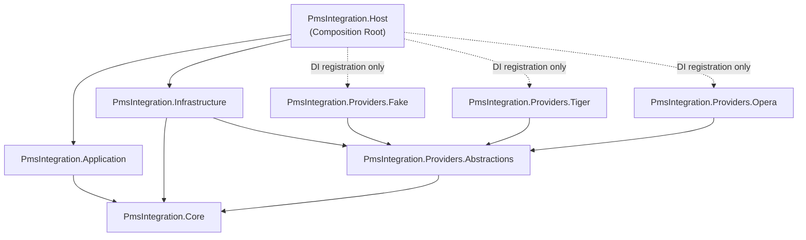
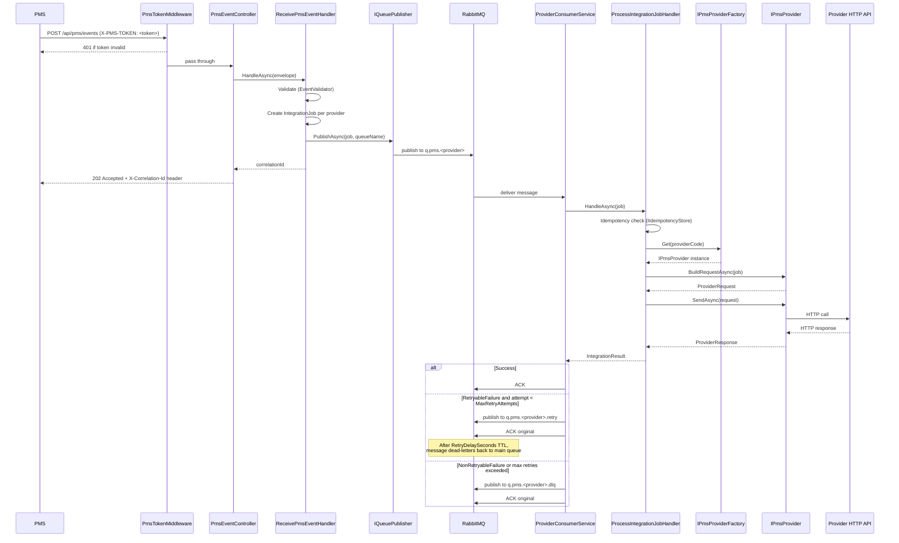

# Architecture

> This document describes the architecture of the PMS Integration Service.  
> Target audience: engineers joining the project.

---

## Table of Contents

1. [Approach: Provider Plugin (B1)](#approach-provider-plugin-b1)
2. [Project Boundaries](#project-boundaries)
3. [Dependency Flow](#dependency-flow)
4. [Layer Responsibilities](#layer-responsibilities)
5. [End-to-End Job Lifecycle](#end-to-end-job-lifecycle)
6. [RabbitMQ Topology](#rabbitmq-topology)
7. [Security](#security)
8. [Idempotency](#idempotency)
9. [Where to Put New Code](#where-to-put-new-code)
10. [Anti-Patterns](#anti-patterns)

---

## Approach: Provider Plugin (B1)

The system uses the **Provider Plugin** pattern (Approach B1).  
Every PMS provider (Tiger, Opera, Fake, �) is an isolated project (`PmsIntegration.Providers.<Name>`) that implements the `IPmsProvider` interface and self-registers via a single DI extension method.

**Why this matters:**
- Adding a provider requires touching only one new project plus two lines in `Host`.
- The core pipeline (`ReceivePmsEventHandler`, `ProcessIntegrationJobHandler`) never changes when providers are added or removed.
- There is **no switch/case** outside `PmsProviderFactory`; provider resolution is always `IPmsProviderFactory.Get(providerCode)`.

---

## Project Boundaries

```
src/
+-- PmsIntegration.Host                    → Composition root only
+-- PmsIntegration.Application             → Business workflow / use-cases
+-- PmsIntegration.Core                    → Contracts, interfaces, domain (zero external deps)
+-- PmsIntegration.Infrastructure          → Implementations: RabbitMQ, Serilog/Elastic, idempotency
+-- Providers/
    +-- PmsIntegration.Providers.Abstractions  → PmsProviderBase (optional helper base class)
    +-- PmsIntegration.Providers.Fake          → Fake provider (dev / test)
    +-- PmsIntegration.Providers.Tiger         → Tiger PMS provider
    +-- PmsIntegration.Providers.Opera         → Opera PMS provider
```

---

## Dependency Flow



**Key rules enforced by this graph:**

| Rule | Enforcement |
|---|---|
| `Core` has zero external package dependencies | `.csproj` ProjectReferences |
| `Application` does not reference `Infrastructure` | No `ProjectReference` to `Infrastructure` |
| Providers do not know about queues | `IPmsProvider` has no queue methods |
| `Host` references Providers **only** for DI calls | `ProvidersServiceExtensions.AddProviders()` |

---

## Layer Responsibilities

### Host (`PmsIntegration.Host`)

The **only composition root** in the solution.

| Responsibility | Class / File |
|---|---|
| Register all services | `Program.cs` |
| Validate PMS token | `PmsTokenMiddleware` |
| Accept HTTP events | `PmsEventController` ? `POST /api/pms/events` |
| Start per-provider consumers | `ProviderConsumerOrchestrator` (IHostedService) |
| Run one consumer per provider | `ProviderConsumerService` |
| Register all providers | `ProvidersServiceExtensions.AddProviders()` |
| Security options | `PmsSecurityOptions` |

Host **must not** contain business logic, provider mapping, or direct HTTP calls to provider APIs.

---

### Application (`PmsIntegration.Application`)

Implements the two main use-cases. Depends only on `Core` interfaces.

| Class | Responsibility |
|---|---|
| `ReceivePmsEventHandler` | Validates `PmsEventEnvelope`, creates one `IntegrationJob` per provider, publishes to queues |
| `ProcessIntegrationJobHandler` | Resolves the provider via `IPmsProviderFactory`, calls `BuildRequestAsync` + `SendAsync`, classifies the result |
| `EventValidator` | Validates required fields on `PmsEventEnvelope` |
| `ProviderRouter` | Resolves the RabbitMQ queue name for a given provider key (reads `Queues:ProviderQueues:<KEY>` from config; falls back to `q.pms.<providerkey>`) |
| `RetryClassifier` | Maps HTTP status codes and exceptions → `IntegrationOutcome` |

Application **must not** reference `RabbitMQ.Client`, `HttpClient`, or any Infrastructure type directly.

---

### Core (`PmsIntegration.Core`)

Zero external runtime dependencies. Defines all contracts and shapes.

**Contracts (data shapes):**

| Type | Purpose |
|---|---|
| `PmsEventEnvelope` | Inbound payload from the PMS over HTTP |
| `IntegrationJob` | Per-provider unit of work placed on a queue |
| `ProviderRequest` | Provider-specific HTTP request built by the provider module |
| `ProviderResponse` | Raw response returned from the provider API |
| `IntegrationResult` | Outcome returned by `ProcessIntegrationJobHandler` |

**Abstractions (interfaces):**

| Interface | Implemented in |
|---|---|
| `IPmsProvider` | Each `Providers.*` project |
| `IPmsProviderFactory` | `Infrastructure/Providers/PmsProviderFactory` |
| `IQueuePublisher` | `Infrastructure/RabbitMq/RabbitMqQueuePublisher` |
| `IAuditLogger` | `Infrastructure/Logging/ElasticAuditLogger` |
| `IIdempotencyStore` | `Infrastructure/Idempotency/InMemoryIdempotencyStore` (default) |
| `IClock` | `Infrastructure/Clock/SystemClock` |
| `IConfigProvider` | `Infrastructure/Config/AppSettingsConfigProvider` |
| `IPmsMapper` | Mapper class in each `Providers.*` project |
| `IPmsRequestBuilder` | Request builder in each `Providers.*` project |
| `IPmsClient` | HTTP client in each `Providers.*` project |

---

### Infrastructure (`PmsIntegration.Infrastructure`)

Implements every `Core` interface. Also houses `PmsProviderFactory`.

| Sub-folder | Key types |
|---|---|
| `RabbitMq/` | `RabbitMqConnectionFactory`, `RabbitMqTopology`, `RabbitMqQueuePublisher`, `RabbitMqHeaders` |
| `Logging/` | `ElasticAuditLogger`, `SerilogElasticSetup` |
| `Idempotency/` | `InMemoryIdempotencyStore`, `RedisIdempotencyStore` |
| `Http/DelegatingHandlers/` | `CorrelationIdHandler` — injects `X-Correlation-Id` into outbound HTTP requests; registered in DI but must be wired to each named `HttpClient` via `.AddHttpMessageHandler<CorrelationIdHandler>()` in the provider's DI extension |
| `Config/` | `AppSettingsConfigProvider` |
| `Clock/` | `SystemClock` |
| `Options/` | `RabbitMqOptions`, `QueueOptions` |
| `Providers/` | `PmsProviderFactory` |

Registration entry point: `services.AddInfrastructure(configuration)`.

---

### Providers.Abstractions (`PmsIntegration.Providers.Abstractions`)

Contains `PmsProviderBase` � an optional abstract class for provider implementations.  
Providers may also implement `IPmsProvider` directly.

---

### Provider projects (`PmsIntegration.Providers.*`)

Mandatory internal structure per provider:

```
ProviderXOptions.cs               ? Config POCO bound to Providers:<KEY>
ProviderXRequestBuilder.cs        ? Maps IntegrationJob ? ProviderRequest (no HTTP)
ProviderXClient.cs                ? Sends HTTP request, returns ProviderResponse
Mapping/ProviderXMapper.cs        ? Pure data mapping (unit-testable)
DI/ProviderXServiceExtensions.cs  ? services.AddXxxProvider(configuration)
```

---

## End-to-End Job Lifecycle



---

## RabbitMQ Topology

`RabbitMqTopology` exposes `DeclareProviderQueuesAsync(mainQueue)` to declare the three queues for a provider. This method must be called explicitly from startup or deployment scripting before consumers start consuming — it is **not** invoked automatically by the framework. If queues are pre-created in RabbitMQ (e.g. via management UI or `rabbitmqadmin`), this call is optional.

```
q.pms.tiger           durable main queue
q.pms.tiger.retry     durable, x-message-ttl ? x-dead-letter-routing-key ? q.pms.tiger
q.pms.tiger.dlq       durable dead-letter queue; requires manual inspection
```

Queue names come from `appsettings.json` section `Queues:ProviderQueues`.

Retry configuration:

| Config key | Default | Purpose |
|---|---|---|
| `Queues:RetryDelaySeconds` | `30` | TTL of the `.retry` queue in seconds |
| `Queues:MaxRetryAttempts` | `3` | After this many attempts the message goes to `.dlq` |

The retry attempt counter is tracked in the `x-retry-attempt` RabbitMQ message header.

**Do not use `BasicNack(requeue: true)`** � this causes an unbounded hot-loop with no delay.

---

## Security

`PmsTokenMiddleware` protects all routes under `/api/pms/*`.

- Header name: `PmsSecurity:HeaderName` (default `X-PMS-TOKEN`)
- Expected value: `PmsSecurity:FixedToken`
- On mismatch or absent header: `HTTP 401 {"error":"unauthorized"}`

No JWT or OAuth is involved. The token is a shared secret per environment, rotated manually.

---

## Idempotency

Idempotency key:

```
{hotelId}:{eventId}:{eventType}:{providerKey}
```

When `IIdempotencyStore.TryAcquire` returns `false`, the job is treated as a duplicate. `ProcessIntegrationJobHandler` returns `Success` immediately without calling the provider.

| Implementation | When to use |
|---|---|
| `InMemoryIdempotencyStore` | Development / single instance (default registration) |
| `RedisIdempotencyStore` | Production / multi-instance |
| `SqlIdempotencyStore` | Placeholder skeleton — throws `NotImplementedException`; wire a `DbContext` or Dapper before using |

Swap the implementation via the DI registration in `InfrastructureServiceExtensions`.

---

## Where to Put New Code

| Scenario | Where |
|---|---|
| New PMS event type (field changes) | `Core/Contracts/PmsEventEnvelope.cs` |
| New validation rule for inbound events | `Application/Services/EventValidator.cs` |
| New retry / error classification rule | `Application/Services/RetryClassifier.cs` |
| New PMS provider | New `PmsIntegration.Providers.<Name>` project � see [PROVIDERS.md](PROVIDERS.md) |
| New RabbitMQ feature | `Infrastructure/RabbitMq/` |
| New audit log field | `Infrastructure/Logging/ElasticAuditLogger.cs` |
| New idempotency store | `Infrastructure/Idempotency/` � implement `IIdempotencyStore` |
| New HTTP middleware | `Host/Middleware/` |
| New API endpoint | `Host/Controllers/` |

---

## Anti-Patterns

| Anti-pattern | Why it is forbidden | Correct approach |
|---|---|---|
| `switch(providerCode)` outside `PmsProviderFactory` | Breaks the plugin design; requires editing existing code per new provider | Use `IPmsProviderFactory.Get(providerCode)` |
| Calling `HttpClient` directly from `Application` | Violates layer boundary | Application calls `IPmsProvider.SendAsync` |
| Referencing `RabbitMQ.Client` from `Core` or `Application` | `Core` must have zero infrastructure deps | Queue operations belong in `Infrastructure` |
| Adding provider-specific logic to `Host` | `Host` is a composition root | All provider logic lives in `Providers.*` |
| Registering a provider class manually in `Program.cs` | Bypasses the plugin pattern | Call `services.AddProviders(config)` |
| `BasicNack(requeue: true)` for retries | Infinite hot-loop with no back-off | Publish to `.retry` queue, then ACK |
| Committing real credentials in `appsettings.json` | Security risk | Use environment variables or a secrets manager |
| One provider project referencing another | Providers must be completely isolated | Providers only reference `Providers.Abstractions` and `Core` |
