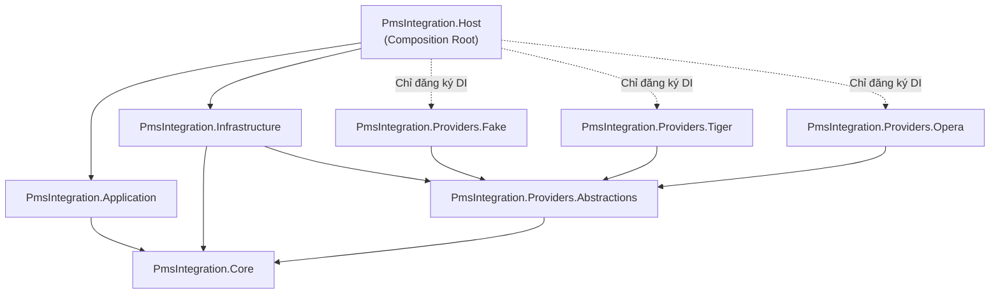
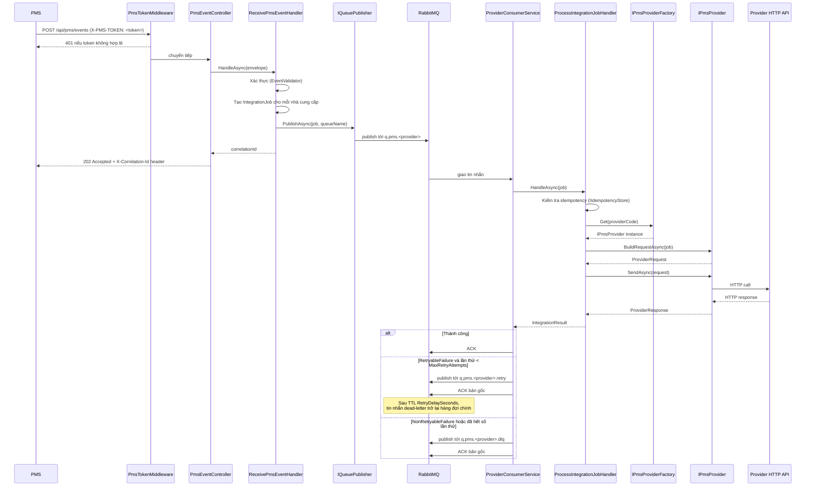

# Kiến trúc

> Tài liệu này mô tả kiến trúc của Dịch vụ Tích hợp PMS.  
> Đối tượng đọc: kỹ sư mới tham gia dự án.

---

## Mục lục

1. [Cách tiếp cận: Provider Plugin (B1)](#cách-tiếp-cận-provider-plugin-b1)
2. [Ranh giới dự án](#ranh-giới-dự-án)
3. [Luồng phụ thuộc](#luồng-phụ-thuộc)
4. [Trách nhiệm từng tầng](#trách-nhiệm-từng-tầng)
5. [Vòng đời Job từ đầu đến cuối](#vòng-đời-job-từ-đầu-đến-cuối)
6. [Cấu trúc RabbitMQ](#cấu-trúc-rabbitmq)
7. [Bảo mật](#bảo-mật)
8. [Idempotency](#idempotency)
9. [Đặt code mới ở đâu](#đặt-code-mới-ở-đâu)
10. [Các anti-pattern](#các-anti-pattern)

---

## Cách tiếp cận: Provider Plugin (B1)

Hệ thống sử dụng pattern **Provider Plugin** (Cách tiếp cận B1).  
Mỗi nhà cung cấp PMS (Tiger, Opera, Fake, …) là một dự án độc lập (`PmsIntegration.Providers.<Tên>`) triển khai interface `IPmsProvider` và tự đăng ký thông qua một DI extension method duy nhất.

**Tại sao điều này quan trọng:**
- Thêm một nhà cung cấp chỉ cần tạo một dự án mới và thêm hai dòng trong `Host`.
- Pipeline cốt lõi (`ReceivePmsEventHandler`, `ProcessIntegrationJobHandler`) không bao giờ thay đổi khi thêm hoặc xóa nhà cung cấp.
- Không có **switch/case** nào ngoài `PmsProviderFactory`; việc phân giải nhà cung cấp luôn dùng `IPmsProviderFactory.Get(providerCode)`.

---

## Ranh giới dự án

```
src/
+-- PmsIntegration.Host                    → Chỉ là composition root
+-- PmsIntegration.Application             → Quy trình nghiệp vụ / use-cases
+-- PmsIntegration.Core                    → Hợp đồng, interfaces, domain (không có deps bên ngoài)
+-- PmsIntegration.Infrastructure          → Implementations: RabbitMQ, Serilog/Elastic, idempotency
+-- Providers/
    +-- PmsIntegration.Providers.Abstractions  → PmsProviderBase (lớp cơ sở tùy chọn)
    +-- PmsIntegration.Providers.Fake          → Fake provider (dev / test)
    +-- PmsIntegration.Providers.Tiger         → Nhà cung cấp Tiger PMS
    +-- PmsIntegration.Providers.Opera         → Nhà cung cấp Opera PMS
```

---

## Luồng phụ thuộc



**Các quy tắc chính được enforced bởi sơ đồ này:**

| Quy tắc | Cách enforce |
|---|---|
| `Core` không có phụ thuộc gói ngoài | `ProjectReferences` trong `.csproj` |
| `Application` không tham chiếu `Infrastructure` | Không có `ProjectReference` tới `Infrastructure` |
| Providers không biết về hàng đợi | `IPmsProvider` không có phương thức queue |
| `Host` tham chiếu Providers **chỉ** cho các lệnh gọi DI | `ProvidersServiceExtensions.AddProviders()` |

---

## Trách nhiệm từng tầng

### Host (`PmsIntegration.Host`)

**Composition root duy nhất** trong solution.

| Trách nhiệm | Class / File |
|---|---|
| Đăng ký tất cả services | `Program.cs` |
| Xác thực PMS token | `PmsTokenMiddleware` |
| Nhận sự kiện HTTP | `PmsEventController` → `POST /api/pms/events` |
| Khởi động consumer theo từng nhà cung cấp | `ProviderConsumerOrchestrator` (IHostedService) |
| Chạy một consumer mỗi nhà cung cấp | `ProviderConsumerService` |
| Đăng ký tất cả nhà cung cấp | `ProvidersServiceExtensions.AddProviders()` |
| Tùy chọn bảo mật | `PmsSecurityOptions` |

Host **không được** chứa business logic, provider mapping, hoặc gọi HTTP trực tiếp đến provider APIs.

---

### Application (`PmsIntegration.Application`)

Triển khai hai use-case chính. Chỉ phụ thuộc vào các interfaces trong `Core`.

| Class | Trách nhiệm |
|---|---|
| `ReceivePmsEventHandler` | Xác thực `PmsEventEnvelope`, tạo một `IntegrationJob` cho mỗi nhà cung cấp, publish lên hàng đợi |
| `ProcessIntegrationJobHandler` | Phân giải nhà cung cấp qua `IPmsProviderFactory`, gọi `BuildRequestAsync` + `SendAsync`, phân loại kết quả |
| `EventValidator` | Xác thực các trường bắt buộc trên `PmsEventEnvelope` |
| `ProviderRouter` | Phân giải tên hàng đợi RabbitMQ cho một provider key (đọc `Queues:ProviderQueues:<KEY>` từ config; fallback là `q.pms.<providerkey>`) |
| `RetryClassifier` | Map HTTP status codes và exceptions → `IntegrationOutcome` |

Application **không được** tham chiếu `RabbitMQ.Client`, `HttpClient`, hoặc bất kỳ kiểu Infrastructure nào trực tiếp.

---

### Core (`PmsIntegration.Core`)

Không có phụ thuộc runtime bên ngoài. Định nghĩa tất cả hợp đồng và hình dạng dữ liệu.

**Contracts (hình dạng dữ liệu):**

| Kiểu | Mục đích |
|---|---|
| `PmsEventEnvelope` | Payload đầu vào từ PMS qua HTTP |
| `IntegrationJob` | Đơn vị công việc per-provider được đặt lên hàng đợi |
| `ProviderRequest` | HTTP request dành riêng cho nhà cung cấp, được build bởi provider module |
| `ProviderResponse` | Phản hồi thô trả về từ provider API |
| `IntegrationResult` | Kết quả trả về bởi `ProcessIntegrationJobHandler` |

**Abstractions (interfaces):**

| Interface | Được triển khai trong |
|---|---|
| `IPmsProvider` | Mỗi dự án `Providers.*` |
| `IPmsProviderFactory` | `Infrastructure/Providers/PmsProviderFactory` |
| `IQueuePublisher` | `Infrastructure/RabbitMq/RabbitMqQueuePublisher` |
| `IAuditLogger` | `Infrastructure/Logging/ElasticAuditLogger` |
| `IIdempotencyStore` | `Infrastructure/Idempotency/InMemoryIdempotencyStore` (mặc định) |
| `IClock` | `Infrastructure/Clock/SystemClock` |
| `IConfigProvider` | `Infrastructure/Config/AppSettingsConfigProvider` |
| `IPmsMapper` | Lớp Mapper trong mỗi dự án `Providers.*` |
| `IPmsRequestBuilder` | Request builder trong mỗi dự án `Providers.*` |
| `IPmsClient` | HTTP client trong mỗi dự án `Providers.*` |

---

### Infrastructure (`PmsIntegration.Infrastructure`)

Triển khai mọi interface trong `Core`. Cũng chứa `PmsProviderFactory`.

| Thư mục con | Các kiểu chính |
|---|---|
| `RabbitMq/` | `RabbitMqConnectionFactory`, `RabbitMqTopology`, `RabbitMqQueuePublisher`, `RabbitMqHeaders` |
| `Logging/` | `ElasticAuditLogger`, `SerilogElasticSetup` |
| `Idempotency/` | `InMemoryIdempotencyStore`, `RedisIdempotencyStore` |
| `Http/DelegatingHandlers/` | `CorrelationIdHandler` — inject `X-Correlation-Id` vào HTTP request đi ra; được đăng ký trong DI nhưng phải wired với từng named `HttpClient` qua `.AddHttpMessageHandler<CorrelationIdHandler>()` trong DI extension của provider |
| `Config/` | `AppSettingsConfigProvider` |
| `Clock/` | `SystemClock` |
| `Options/` | `RabbitMqOptions`, `QueueOptions` |
| `Providers/` | `PmsProviderFactory` |

Điểm vào đăng ký: `services.AddInfrastructure(configuration)`.

---

### Providers.Abstractions (`PmsIntegration.Providers.Abstractions`)

Chứa `PmsProviderBase` — lớp abstract tùy chọn cho các triển khai provider.  
Providers cũng có thể triển khai `IPmsProvider` trực tiếp.

---

### Dự án Provider (`PmsIntegration.Providers.*`)

Cấu trúc nội bộ bắt buộc theo từng provider:

```
ProviderXOptions.cs               → Config POCO gắn với Providers:<KEY>
ProviderXRequestBuilder.cs        → Map IntegrationJob → ProviderRequest (không có HTTP)
ProviderXClient.cs                → Gửi HTTP request, trả về ProviderResponse
Mapping/ProviderXMapper.cs        → Pure data mapping (có thể unit-test)
DI/ProviderXServiceExtensions.cs  → services.AddXxxProvider(configuration)
```

---

## Vòng đời Job từ đầu đến cuối



---

## Cấu trúc RabbitMQ

`RabbitMqTopology` cung cấp `DeclareProviderQueuesAsync(mainQueue)` để khai báo ba hàng đợi cho một nhà cung cấp. Phương thức này phải được gọi rõ ràng khi khởi động hoặc trong script triển khai trước khi các consumer bắt đầu — nó **không** được gọi tự động bởi framework. Nếu hàng đợi đã được tạo sẵn trong RabbitMQ (qua management UI hoặc `rabbitmqadmin`), lệnh gọi này là tùy chọn.

```
q.pms.tiger           hàng đợi chính durable
q.pms.tiger.retry     durable, x-message-ttl → x-dead-letter-routing-key → q.pms.tiger
q.pms.tiger.dlq       hàng đợi dead-letter durable; cần kiểm tra thủ công
```

Tên hàng đợi đến từ section `Queues:ProviderQueues` trong `appsettings.json`.

Cấu hình retry:

| Khóa cấu hình | Mặc định | Mục đích |
|---|---|---|
| `Queues:RetryDelaySeconds` | `30` | TTL của hàng đợi `.retry` tính bằng giây |
| `Queues:MaxRetryAttempts` | `3` | Sau số lần này, tin nhắn chuyển sang `.dlq` |

Bộ đếm số lần thử lại được theo dõi trong header tin nhắn RabbitMQ `x-retry-attempt`.

**Không sử dụng `BasicNack(requeue: true)`** — điều này gây ra vòng lặp nóng vô hạn không có độ trễ.

---

## Bảo mật

`PmsTokenMiddleware` bảo vệ tất cả route dưới `/api/pms/*`.

- Tên header: `PmsSecurity:HeaderName` (mặc định `X-PMS-TOKEN`)
- Giá trị mong đợi: `PmsSecurity:FixedToken`
- Khi không khớp hoặc thiếu header: `HTTP 401 {"error":"unauthorized"}`

Không có JWT hoặc OAuth. Token là shared secret theo môi trường, được thay đổi thủ công.

---

## Idempotency

Khóa idempotency:

```
{hotelId}:{eventId}:{eventType}:{providerKey}
```

Khi `IIdempotencyStore.TryAcquire` trả về `false`, job được coi là trùng lặp. `ProcessIntegrationJobHandler` trả về `Success` ngay lập tức mà không gọi provider.

| Triển khai | Khi nào dùng |
|---|---|
| `InMemoryIdempotencyStore` | Development / single instance (đăng ký mặc định) |
| `RedisIdempotencyStore` | Production / multi-instance |
| `SqlIdempotencyStore` | Skeleton placeholder — throw `NotImplementedException`; cần wire `DbContext` hoặc Dapper trước khi dùng |

Thay đổi triển khai qua đăng ký DI trong `InfrastructureServiceExtensions`.

---

## Đặt code mới ở đâu

| Tình huống | Nơi đặt |
|---|---|
| Kiểu sự kiện PMS mới (thay đổi trường) | `Core/Contracts/PmsEventEnvelope.cs` |
| Quy tắc xác thực mới cho sự kiện đầu vào | `Application/Services/EventValidator.cs` |
| Quy tắc retry / phân loại lỗi mới | `Application/Services/RetryClassifier.cs` |
| Nhà cung cấp PMS mới | Dự án mới `PmsIntegration.Providers.<Tên>` — xem [PROVIDERS.md](PROVIDERS.md) |
| Tính năng RabbitMQ mới | `Infrastructure/RabbitMq/` |
| Trường audit log mới | `Infrastructure/Logging/ElasticAuditLogger.cs` |
| Idempotency store mới | `Infrastructure/Idempotency/` — triển khai `IIdempotencyStore` |
| HTTP middleware mới | `Host/Middleware/` |
| API endpoint mới | `Host/Controllers/` |

---

## Các anti-pattern

| Anti-pattern | Tại sao bị cấm | Cách đúng |
|---|---|---|
| `switch(providerCode)` ngoài `PmsProviderFactory` | Phá vỡ thiết kế plugin; yêu cầu chỉnh sửa code hiện có khi thêm nhà cung cấp mới | Dùng `IPmsProviderFactory.Get(providerCode)` |
| Gọi `HttpClient` trực tiếp từ `Application` | Vi phạm ranh giới tầng | Application gọi `IPmsProvider.SendAsync` |
| Tham chiếu `RabbitMQ.Client` từ `Core` hoặc `Application` | `Core` phải không có deps infrastructure | Các thao tác queue thuộc về `Infrastructure` |
| Thêm logic dành riêng cho provider vào `Host` | `Host` là composition root | Tất cả logic provider nằm trong `Providers.*` |
| Đăng ký lớp provider thủ công trong `Program.cs` | Bỏ qua pattern plugin | Gọi `services.AddProviders(config)` |
| `BasicNack(requeue: true)` cho retry | Vòng lặp nóng vô hạn không có back-off | Publish lên hàng đợi `.retry`, sau đó ACK |
| Commit thông tin đăng nhập thật trong `appsettings.json` | Rủi ro bảo mật | Dùng biến môi trường hoặc secrets manager |
| Một dự án provider tham chiếu dự án provider khác | Providers phải hoàn toàn độc lập | Providers chỉ tham chiếu `Providers.Abstractions` và `Core` |
