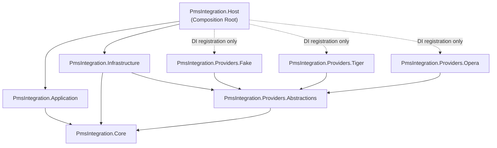
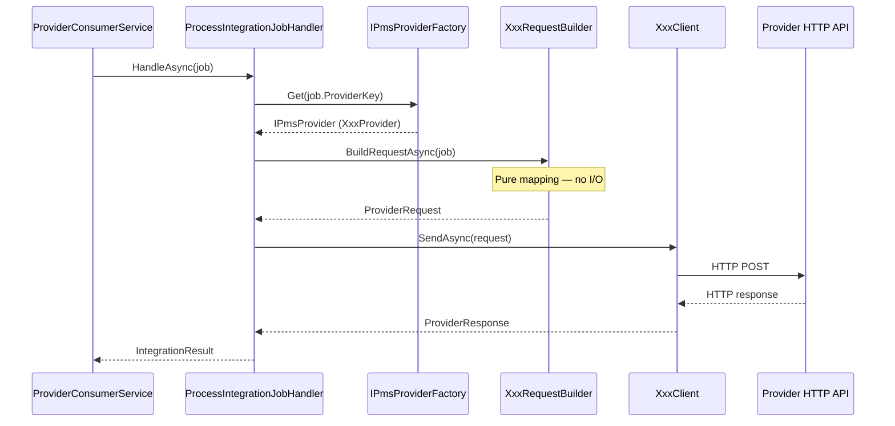
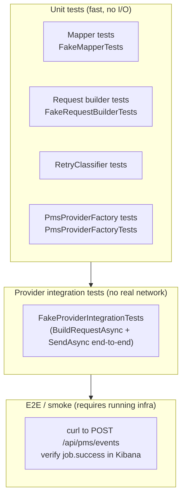
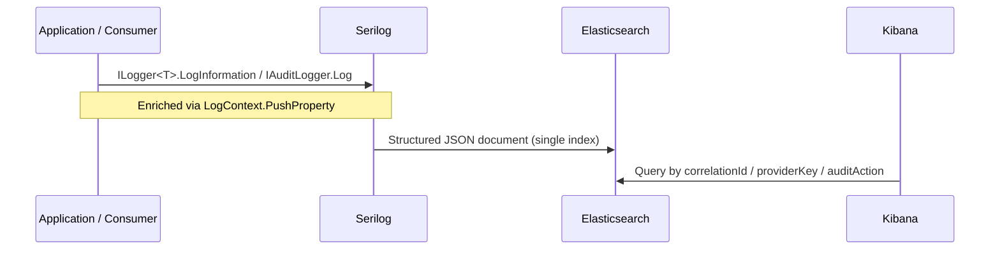

# Developer Handbook

> Welcome to the PMS Integration Service team.  
> This handbook is your single reference for understanding how the codebase is structured,
> how to extend it, and how to operate it. All code examples use real class names from the
> source; anything uncertain is marked **TODO**.

---

## Table of Contents

1. [Architecture at a Glance](#architecture-at-a-glance)
2. [Where Code Lives](#where-code-lives)
3. [Running the Service Locally](#running-the-service-locally)
4. [Adding a New Provider](#adding-a-new-provider)
5. [Adding a New Event Type](#adding-a-new-event-type)
6. [Testing Strategy](#testing-strategy)
7. [Logging and Troubleshooting in Kibana](#logging-and-troubleshooting-in-kibana)
8. [Common Pitfalls and Anti-Patterns](#common-pitfalls-and-anti-patterns)

---

## Architecture at a Glance

The service is an **integration gateway**: it accepts HTTP events from a PMS (Property
Management System), fans each event out to one RabbitMQ queue per provider, and processes
those queues asynchronously.

The structural pattern is **Provider Plugin (Approach B1)**. Every provider
(Tiger, Opera, Fake, …) is an isolated project that implements `IPmsProvider`. The pipeline
never contains a `switch(providerCode)` — it calls `IPmsProviderFactory.Get(providerCode)`
and the factory resolves the right plugin.

### Dependency diagram



### What each layer is allowed to do

| Layer | Can reference | Cannot reference |
|---|---|---|
| `Core` | nothing | everything else |
| `Application` | `Core` | `Infrastructure`, any `Providers.*` |
| `Infrastructure` | `Core`, `Providers.Abstractions` | `Application`, any `Providers.*` |
| `Providers.*` | `Core`, `Providers.Abstractions` | each other, `Infrastructure`, `Application` |
| `Host` | everything (DI wiring only) | must not contain business logic |

---

## Where Code Lives

### Annotated project map

```
src/
│
├── PmsIntegration.Core/
│   ├── Abstractions/           ← interfaces only (IPmsProvider, IPmsProviderFactory,
│   │                              IQueuePublisher, IAuditLogger, IIdempotencyStore,
│   │                              IClock, IConfigProvider, IPmsMapper,
│   │                              IPmsRequestBuilder, IPmsClient)
│   ├── Contracts/              ← data shapes: PmsEventEnvelope, IntegrationJob,
│   │                              ProviderRequest, ProviderResponse, IntegrationResult
│   └── Domain/                 ← value types: IntegrationOutcome, …
│
├── PmsIntegration.Application/
│   ├── UseCases/
│   │   ├── ReceivePmsEventHandler.cs   ← validate → fan-out → enqueue
│   │   └── ProcessIntegrationJobHandler.cs ← idempotency → factory.Get → build → send
│   ├── Services/
│   │   ├── EventValidator.cs    ← validates PmsEventEnvelope fields
│   │   ├── ProviderRouter.cs    ← maps providerKey → queue name
│   │   └── RetryClassifier.cs  ← HTTP status / exception → IntegrationOutcome
│   └── DI/
│       └── ApplicationServiceExtensions.cs
│
├── PmsIntegration.Infrastructure/
│   ├── RabbitMq/
│   │   ├── RabbitMqConnectionFactory.cs  ← singleton IConnection
│   │   ├── RabbitMqTopology.cs           ← declares main/retry/dlq per provider
│   │   ├── RabbitMqQueuePublisher.cs     ← IQueuePublisher implementation
│   │   └── RabbitMqHeaders.cs
│   ├── Logging/
│   │   ├── ElasticAuditLogger.cs         ← IAuditLogger → writes AUDIT log entries
│   │   └── SerilogElasticSetup.cs        ← bootstraps Serilog → Console (Elasticsearch sink is a commented-out production TODO)
│   ├── Idempotency/
│   │   ├── InMemoryIdempotencyStore.cs   ← default (dev/single-instance)
│   │   ├── RedisIdempotencyStore.cs      ← production
│   │   └── SqlIdempotencyStore.cs        ← placeholder skeleton (NotImplementedException)
│   ├── Http/DelegatingHandlers/
│   │   └── CorrelationIdHandler.cs       ← injects X-Correlation-Id; must be wired to each named HttpClient via .AddHttpMessageHandler<CorrelationIdHandler>()
│   ├── Config/
│   │   └── AppSettingsConfigProvider.cs
│   ├── Clock/
│   │   └── SystemClock.cs
│   ├── Providers/
│   │   └── PmsProviderFactory.cs         ← IPmsProviderFactory (receives IEnumerable<IPmsProvider>)
│   └── DI/
│       └── InfrastructureServiceExtensions.cs
│
├── Providers/
│   ├── PmsIntegration.Providers.Abstractions/
│   │   └── PmsProviderBase.cs                ← optional base class for providers
│   │
│   ├── PmsIntegration.Providers.Fake/        ← reference implementation, used in tests
│   ├── PmsIntegration.Providers.Tiger/
│   └── PmsIntegration.Providers.Opera/
│       (each follows the structure described in §4)
```

```
tests/
├── PmsIntegration.Infrastructure.Tests/
│   └── PmsProviderFactoryTests.cs       ← factory: resolution, duplicate key, unknown key
└── PmsIntegration.Providers.Fake.Tests/
    ├── FakeMapperTests.cs               ← pure unit: field mapping
    ├── FakeRequestBuilderTests.cs       ← pure unit: endpoint, headers, body
    ├── FakeClientTests.cs               ← unit: happy path, failure simulation
    └── FakeProviderIntegrationTests.cs  ← provider-level integration (no infra)
```

---

## Running the Service Locally

### Prerequisites

- .NET 10 SDK
- Docker (for RabbitMQ)
- Elasticsearch (optional — not required locally; `SerilogElasticSetup` currently writes to Console only)

### Start dependencies

```bash
docker run -d --name rabbitmq \
  -p 5672:5672 -p 15672:15672 \
  rabbitmq:3-management
```

### Configure the local token

Create or edit `src/PmsIntegration.Host/appsettings.Development.json`:

```json
{
  "PmsSecurity": {
    "FixedToken": "dev-token"
  }
}
```

### Run

```bash
dotnet build PmsIntegration.sln
dotnet run --project src/PmsIntegration.Host/PmsIntegration.Host.csproj
```

### Smoke test

```bash
curl -X POST https://localhost:<port>/api/pms/events \
  -H "Content-Type: application/json" \
  -H "X-PMS-TOKEN: dev-token" \
  -d '{
    "hotelId": "H001",
    "eventId": "EVT-001",
    "eventType": "Checkin",
    "providers": ["FAKE"],
    "data": { "guestName": "Jane Doe" }
  }'
```

Expected:

```
HTTP 202 Accepted
X-Correlation-Id: <guid>
{ "status": "accepted", "correlationId": "<guid>" }
```

---

## Adding a New Provider

This is the most common task. The estimate is **~30 minutes** for a new provider with no
external API quirks. Follow these steps exactly.

### Lifecycle of a provider call



### Step 1 — Create the project

Create `src/Providers/PmsIntegration.Providers.Acme/PmsIntegration.Providers.Acme.csproj`:

```xml
<Project Sdk="Microsoft.NET.Sdk">
  <PropertyGroup>
    <TargetFramework>net10.0</TargetFramework>
    <Nullable>enable</Nullable>
    <ImplicitUsings>enable</ImplicitUsings>
  </PropertyGroup>
  <ItemGroup>
    <!-- Providers.Abstractions is a sibling folder inside src/Providers/ -->
    <ProjectReference Include="..\PmsIntegration.Providers.Abstractions\PmsIntegration.Providers.Abstractions.csproj" />
    <!-- Core is two levels up (src/PmsIntegration.Core/) -->
    <ProjectReference Include="..\..\PmsIntegration.Core\PmsIntegration.Core.csproj" />
  </ItemGroup>
</Project>
```

Add the project to the solution:

```bash
dotnet sln PmsIntegration.sln add src/Providers/PmsIntegration.Providers.Acme/PmsIntegration.Providers.Acme.csproj
```

### Step 2 — Options class

```csharp
// AcmeOptions.cs
namespace PmsIntegration.Providers.Acme;

public sealed class AcmeOptions
{
    public string BaseUrl        { get; set; } = string.Empty;
    public string ApiKey         { get; set; } = string.Empty;
    public int    TimeoutSeconds { get; set; } = 15;
    // Add any provider-specific fields here
}
```

### Step 3 — Mapper (pure function, unit-testable)

```csharp
// Mapping/AcmeMapper.cs
using PmsIntegration.Core.Contracts;

namespace PmsIntegration.Providers.Acme.Mapping;

public sealed class AcmeMapper
{
    /// <summary>
    /// Maps IntegrationJob to the Acme API body schema.
    /// No I/O. Must be deterministic.
    /// </summary>
    public AcmeEventPayload Map(IntegrationJob job)
    {
        // TODO: map job.Data fields to the Acme schema
        return new AcmeEventPayload
        {
            HotelId   = job.HotelId,
            EventId   = job.EventId,
            EventType = job.EventType
        };
    }
}

// TODO: define to match the Acme API request body
public sealed class AcmeEventPayload
{
    public string HotelId   { get; set; } = string.Empty;
    public string EventId   { get; set; } = string.Empty;
    public string EventType { get; set; } = string.Empty;
}
```

### Step 4 — Request builder

```csharp
// AcmeRequestBuilder.cs
using System.Text.Json;
using Microsoft.Extensions.Options;
using PmsIntegration.Core.Contracts;
using PmsIntegration.Providers.Acme.Mapping;

namespace PmsIntegration.Providers.Acme;

public sealed class AcmeRequestBuilder
{
    private readonly AcmeMapper   _mapper;
    private readonly AcmeOptions  _options;

    public AcmeRequestBuilder(AcmeMapper mapper, IOptions<AcmeOptions> options)
    {
        _mapper  = mapper;
        _options = options.Value;
    }

    public Task<ProviderRequest> BuildAsync(IntegrationJob job, CancellationToken ct = default)
    {
        var payload = _mapper.Map(job);

        return Task.FromResult(new ProviderRequest
        {
            ProviderKey = "ACME",
            Method      = "POST",
            Endpoint    = $"{_options.BaseUrl.TrimEnd('/')}/events",
            JsonBody    = JsonSerializer.Serialize(payload),
            Headers     = new Dictionary<string, string>
            {
                ["X-Api-Key"]        = _options.ApiKey,
                ["X-Correlation-Id"] = job.CorrelationId
            }
        });
    }
}
```

> **Note:** Check the actual `ProviderRequest` properties in
> `src/PmsIntegration.Core/Contracts/ProviderRequest.cs` — the Fake tests confirm
> `Endpoint`, `Method`, `JsonBody`, and `Headers` exist.

### Step 5 — HTTP client

```csharp
// AcmeClient.cs
using System.Text;
using Microsoft.Extensions.Logging;
using Microsoft.Extensions.Options;
using PmsIntegration.Core.Contracts;

namespace PmsIntegration.Providers.Acme;

public sealed class AcmeClient
{
    private readonly IHttpClientFactory         _httpFactory;
    private readonly AcmeOptions                _options;
    private readonly ILogger<AcmeClient>        _logger;

    public AcmeClient(
        IHttpClientFactory httpFactory,
        IOptions<AcmeOptions> options,
        ILogger<AcmeClient> logger)
    {
        _httpFactory = httpFactory;
        _options     = options.Value;
        _logger      = logger;
    }

    public async Task<ProviderResponse> SendAsync(ProviderRequest request, CancellationToken ct = default)
    {
        var http = _httpFactory.CreateClient("ACME");

        using var content = new StringContent(request.JsonBody ?? string.Empty, Encoding.UTF8, "application/json");
        // TODO: add provider-specific auth if required beyond the X-Api-Key header set in the builder

        var response = await http.PostAsync(request.Endpoint, content, ct);

        return new ProviderResponse
        {
            StatusCode = (int)response.StatusCode,
            Body       = await response.Content.ReadAsStringAsync(ct)
        };
    }
}
```

### Step 6 — Provider class

```csharp
// AcmeProvider.cs
using PmsIntegration.Core.Contracts;
using PmsIntegration.Providers.Abstractions;

namespace PmsIntegration.Providers.Acme;

public sealed class AcmeProvider : PmsProviderBase
{
    public override string ProviderKey => "ACME";   // must match config key exactly

    private readonly AcmeRequestBuilder _builder;
    private readonly AcmeClient         _client;

    public AcmeProvider(AcmeRequestBuilder builder, AcmeClient client)
    {
        _builder = builder;
        _client  = client;
    }

    public override Task<ProviderRequest> BuildRequestAsync(IntegrationJob job, CancellationToken ct = default)
        => _builder.BuildAsync(job, ct);

    public override Task<ProviderResponse> SendAsync(ProviderRequest request, CancellationToken ct = default)
        => _client.SendAsync(request, ct);
}
```

### Step 7 — DI extension method

```csharp
// DI/AcmeServiceExtensions.cs
using Microsoft.Extensions.Configuration;
using Microsoft.Extensions.DependencyInjection;
using PmsIntegration.Core.Abstractions;
using PmsIntegration.Providers.Acme.Mapping;

namespace PmsIntegration.Providers.Acme.DI;

public static class AcmeServiceExtensions
{
    /// <summary>Config section: Providers:ACME</summary>
    public static IServiceCollection AddAcmeProvider(
        this IServiceCollection services,
        IConfiguration configuration)
    {
        services.Configure<AcmeOptions>(configuration.GetSection("Providers:ACME"));

        services.AddHttpClient("ACME", (sp, client) =>
        {
            var opts = sp.GetRequiredService<Microsoft.Extensions.Options.IOptions<AcmeOptions>>().Value;
            client.BaseAddress = new Uri(opts.BaseUrl);
            client.Timeout     = TimeSpan.FromSeconds(opts.TimeoutSeconds);
        });

        services.AddSingleton<AcmeMapper>();
        services.AddSingleton<AcmeRequestBuilder>();
        services.AddSingleton<AcmeClient>();
        services.AddSingleton<IPmsProvider, AcmeProvider>();   // ← factory discovers this

        return services;
    }
}
```

### Step 8 — Configuration

`appsettings.json` — two new entries:

```json
{
  "Providers": {
    "ACME": {
      "BaseUrl": "https://api.acme-pms.example.com",
      "ApiKey": "",
      "TimeoutSeconds": 15
    }
  },
  "Queues": {
    "ProviderQueues": {
      "ACME": "q.pms.acme"
    }
  }
}
```

### Step 9 — Wire into Host (two changes)

**`src/PmsIntegration.Host/PmsIntegration.Host.csproj`** — add a project reference:

```xml
<ProjectReference Include="..\Providers\PmsIntegration.Providers.Acme\PmsIntegration.Providers.Acme.csproj" />
```

**`src/PmsIntegration.Host/Providers/ProvidersServiceExtensions.cs`** — add one line
**before** `services.AddSingleton<IPmsProviderFactory, PmsProviderFactory>()`:

```csharp
services.AddFakeProvider(configuration);
services.AddTigerProvider(configuration);
services.AddOperaProvider(configuration);
services.AddAcmeProvider(configuration);   // ← new line

services.AddSingleton<IPmsProviderFactory, PmsProviderFactory>();
```

### Step 10 — Build and verify

```bash
dotnet build PmsIntegration.sln
```

At startup the log must contain a line from `ProviderConsumerOrchestrator` for `ACME`.
Check `IPmsProviderFactory.RegisteredKeys` in the health endpoint or startup logs.

### Step 11 — Write tests

See [Testing Strategy — Provider tests](#provider-tests).

---

## Adding a New Event Type

An "event type" is the string value of `PmsEventEnvelope.EventType` (e.g. `"Checkin"`,
`"Checkout"`, `"AddGuest"`). The pipeline is **event-type-agnostic by default** — the
`IntegrationJob` carries the raw `EventType` string and the `JsonElement? Data` opaque payload
straight through to the provider.

A new event type therefore requires changes only where the data shape is interpreted or validated.

### Decision tree

```
Does the new event type need new validation rules?
  └─ Yes → edit EventValidator (Application)

Does the new event type have a different data schema that providers need to map differently?
  └─ Yes → update the Mapper in each affected Providers.* project

Does the new event type require a different routing rule (different queue)?
  └─ Yes → review ProviderRouter (Application) — TODAY it maps by provider key, not event type
           TODO: confirm current routing logic handles this or needs extending

Does the PmsEventEnvelope need a new field?
  └─ Yes → add it to Core/Contracts/PmsEventEnvelope.cs and update IntegrationJob if it needs to carry through
```

### Step-by-step

#### 1 — Validate the new event type (if needed)

Open `src/PmsIntegration.Application/Services/EventValidator.cs` and add any field
requirements specific to the new event type.

```csharp
// Example pattern (check actual implementation first)
if (envelope.EventType == "RoomUpgrade" && envelope.Data.ValueKind == JsonValueKind.Undefined)
    throw new ArgumentException("RoomUpgrade events must include a Data payload.");
```

#### 2 — Update mapper(s) for each affected provider

Each mapper receives a `IntegrationJob` where `job.EventType` identifies the event and
`job.Data` is a `JsonElement?` containing the raw payload.

```csharp
// In AcmeMapper.Map(IntegrationJob job):
return job.EventType switch
{
    "Checkin"     => MapCheckin(job),
    "Checkout"    => MapCheckout(job),
    "RoomUpgrade" => MapRoomUpgrade(job),  // ← new branch
    _             => MapGeneric(job)
};
```

Write a unit test for the new branch — see [Mapper tests](#mapper-tests).

#### 3 — Update IntegrationJob / PmsEventEnvelope (only if new fields are required)

If the new event type carries data that is not representable in `JsonElement? Data`, add strongly
typed fields to `PmsEventEnvelope` and `IntegrationJob` in `Core/Contracts/`.

> Prefer the `JsonElement? Data` opaque bag for event-type-specific payloads.
> Add strongly typed fields to the contracts only for properties that are universal across
> all event types (e.g. `HotelId`, `EventId` already are).

#### 4 — No changes required in

- `Host` — the controller accepts any valid envelope
- `Infrastructure` — queue publishing is provider-keyed, not event-type-keyed  
- `ReceivePmsEventHandler` — fans out by `envelope.Providers`, not by event type
- Other providers — each provider's mapper handles its own event-type branches

---

## Testing Strategy

The project uses **xUnit** and **FluentAssertions**. No mocking framework is required for
provider tests — infrastructure is kept out of provider logic by design.

### Test pyramid



### Mapper tests

Test the mapper class in complete isolation — no DI, no mocks, no network.

```csharp
// Pattern from FakeMapperTests.cs
public sealed class AcmeMapperTests
{
    private readonly AcmeMapper _sut = new();

    [Fact]
    public void Map_ShouldSerializeAllJobFields()
    {
        var job = new IntegrationJob
        {
            HotelId       = "hotel-123",
            EventId       = "evt-456",
            EventType     = "Checkin",
            CorrelationId = "corr-789",
            Data          = JsonDocument.Parse("{\"roomNumber\":\"101\"}").RootElement
        };

        var result = _sut.Map(job);

        result.HotelId.Should().Be("hotel-123");
        result.EventType.Should().Be("Checkin");
        // assert all mapped fields
    }
}
```

### Request builder tests

Construct the builder with `Options.Create(new AcmeOptions { ... })` — no DI container needed.

```csharp
// Pattern from FakeRequestBuilderTests.cs
public sealed class AcmeRequestBuilderTests
{
    private static AcmeRequestBuilder CreateSut(
        string baseUrl = "https://acme.local",
        string apiKey  = "test-key")
    {
        var options = Options.Create(new AcmeOptions
        {
            BaseUrl = baseUrl,
            ApiKey  = apiKey
        });
        return new AcmeRequestBuilder(new AcmeMapper(), options);
    }

    [Fact]
    public async Task BuildAsync_ShouldSetCorrectEndpoint()
    {
        var request = await CreateSut("https://acme.local/").BuildAsync(MakeJob());
        request.Endpoint.Should().Be("https://acme.local/events");
    }

    [Fact]
    public async Task BuildAsync_ShouldSetProviderKeyToACME()
    {
        var request = await CreateSut().BuildAsync(MakeJob());
        request.ProviderKey.Should().Be("ACME");
    }

    [Fact]
    public async Task BuildAsync_ShouldAddApiKeyHeader()
    {
        var request = await CreateSut(apiKey: "secret-xyz").BuildAsync(MakeJob());
        request.Headers.Should().ContainKey("X-Api-Key")
            .WhoseValue.Should().Be("secret-xyz");
    }
}
```

### Provider integration tests

Exercise the full provider chain (`BuildRequestAsync` → `SendAsync`) with no real network.
Use `NullLogger<T>.Instance` for logger dependencies.

```csharp
// Pattern from FakeProviderIntegrationTests.cs
public sealed class AcmeProviderIntegrationTests
{
    private static AcmeProvider CreateProvider()
    {
        var options = Options.Create(new AcmeOptions
        {
            BaseUrl = "https://acme.local",
            ApiKey  = "test-key",
            TimeoutSeconds = 10
        });

        var mapper  = new AcmeMapper();
        var builder = new AcmeRequestBuilder(mapper, options);
        // TODO: if AcmeClient needs a real HTTP call, use WireMock.Net or swap for a test double
        var client  = new AcmeClient(/* ... */, options, NullLogger<AcmeClient>.Instance);

        return new AcmeProvider(builder, client);
    }

    [Fact]
    public void ProviderKey_ShouldBeACME()
    {
        CreateProvider().ProviderKey.Should().Be("ACME");
    }

    [Fact]
    public async Task BuildRequest_ShouldContainHotelId()
    {
        var provider = CreateProvider();
        var job      = new IntegrationJob { HotelId = "H001", EventType = "Checkin", EventId = "E1" };

        var request  = await provider.BuildRequestAsync(job);

        request.ProviderKey.Should().Be("ACME");
        request.JsonBody.Should().Contain("H001");
    }
}
```

### PmsProviderFactory tests

Factory tests live in `PmsIntegration.Infrastructure.Tests` and use lightweight inline stubs
(no mocking framework):

```csharp
// Pattern from PmsProviderFactoryTests.cs
private sealed class StubProvider : IPmsProvider
{
    public StubProvider(string providerKey) => ProviderKey = providerKey;
    public string ProviderKey { get; }
    public Task<ProviderRequest> BuildRequestAsync(IntegrationJob job, CancellationToken ct = default)
        => throw new NotImplementedException();
    public Task<ProviderResponse> SendAsync(ProviderRequest request, CancellationToken ct = default)
        => throw new NotImplementedException();
}

[Fact]
public void Get_WithRegisteredKey_ReturnsCorrectProvider()
{
    var tiger  = new StubProvider("TIGER");
    var opera  = new StubProvider("OPERA");
    var factory = new PmsProviderFactory(new[] { tiger, opera });

    factory.Get("tiger").Should().BeSameAs(tiger);   // case-insensitive
}

[Fact]
public void Get_WithUnknownKey_ThrowsInvalidOperationException()
{
    var factory = new PmsProviderFactory(new[] { new StubProvider("TIGER") });
    var act = () => factory.Get("NONEXISTENT");
    act.Should().Throw<InvalidOperationException>();
}
```

### Running tests

```bash
# All tests
dotnet test PmsIntegration.sln

# Single project
dotnet test tests/PmsIntegration.Providers.Fake.Tests/PmsIntegration.Providers.Fake.Tests.csproj

# Single test class
dotnet test --filter "FullyQualifiedName~FakeMapperTests"
```

---

## Logging and Troubleshooting in Kibana

### How logs flow

> **Current state:** `SerilogElasticSetup.Configure` writes to **Console** only. The diagram below shows the intended production flow with Elasticsearch. Enable it by wiring `Serilog.Sinks.Elasticsearch` in `SerilogElasticSetup.cs`.



Serilog is bootstrapped by `SerilogElasticSetup.Configure` before the DI container starts.
All structured fields placed on `LogContext` appear as first-class Kibana fields.

### Mandatory fields on every log entry

| Field | Type | How it gets there |
|---|---|---|
| `correlationId` | string GUID | `LogContext.PushProperty` in consumer/handler |
| `hotelId` | string | `LogContext.PushProperty` |
| `eventId` | string | `LogContext.PushProperty` |
| `eventType` | string | `LogContext.PushProperty` |
| `providerKey` | string | `LogContext.PushProperty` |
| `jobId` | string GUID | `LogContext.PushProperty` when available |
| `attempt` | int | `LogContext.PushProperty` during consumer retry loop |

### Audit action vocabulary

All audit events are written by `ElasticAuditLogger` with an `auditAction` field:

| `auditAction` | Meaning |
|---|---|
| `pms.received` | Envelope accepted by `PmsEventController` |
| `job.enqueued` | `IntegrationJob` published to provider queue |
| `job.processing` | Consumer started processing a job |
| `job.success` | Provider API responded successfully |
| `job.retryable_failed` | Provider API call failed with a retryable outcome (5xx, 408, 429, timeout) |
| `job.failed` | Provider API call failed with a **non-retryable** outcome (4xx except 408/429, mapping error) |
| `job.provider_not_registered` | `IPmsProviderFactory.Get` could not find a provider for the key |
| `job.duplicate_ignored` | Idempotency check rejected as duplicate |

> **Note:** Moving a job to DLQ is logged via `_logger.LogWarning` inside `ProviderConsumerService` (not via `IAuditLogger`). There is no `job.dlq` audit event emitted.

### Kibana queries for common scenarios

**Trace one event end-to-end:**

```
correlationId:"3fa85f64-5717-4562-b3fc-2c963f66afa6"
```

Sort by `@timestamp` asc. You should see the full sequence:
`pms.received` → `job.enqueued` → `job.processing` → `job.success`

**All failures for a provider (retryable or non-retryable):**

```
providerKey:"TIGER" AND (auditAction:"job.retryable_failed" OR auditAction:"job.failed")
```

**All DLQ events in the last 24 hours:**

```
level:"Warning" AND message:*DLQ*
```

> DLQ routing is logged via `ILogger.LogWarning` in `ProviderConsumerService`, not via `IAuditLogger`.

**A specific hotel's events:**

```
hotelId:"H001" AND eventType:"Checkin"
```

**Retry chain for one job:**

```
jobId:"7c9e6679-7425-40de-944b-e07fc1f90ae7"
```

Sort `@timestamp` asc, check `attempt` field incrementing.

### Reading a failure

When `job.failed` appears, check:

1. `x-last-error-code` — HTTP status or exception type
2. `x-last-error-message` — provider error body excerpt
3. `attempt` — how many retries have occurred

If `attempt` equals `MaxRetryAttempts` (default `3`), the next entry in the log will be a `LogWarning` from `ProviderConsumerService` indicating the job was sent to the DLQ (not an audit action — look for `message:*DLQ*` or `message:*Sending to DLQ*`).

### Pushing log context in new code

Whenever you write a handler or consumer that processes an `IntegrationJob`, push the
mandatory fields immediately:

```csharp
using (Serilog.Context.LogContext.PushProperty("correlationId", job.CorrelationId))
using (Serilog.Context.LogContext.PushProperty("hotelId",       job.HotelId))
using (Serilog.Context.LogContext.PushProperty("eventId",       job.EventId))
using (Serilog.Context.LogContext.PushProperty("eventType",     job.EventType))
using (Serilog.Context.LogContext.PushProperty("providerKey",   job.ProviderKey))
using (Serilog.Context.LogContext.PushProperty("jobId",         job.JobId))
{
    // all log calls inside this block will carry these fields automatically
}
```

> Only use `Serilog.Context.LogContext` in `Infrastructure` and `Host`.
> In `Application` and `Core`, use `ILogger<T>` injected via DI — never reference Serilog directly.

---

## Common Pitfalls and Anti-Patterns

### 1. `switch(providerCode)` outside `PmsProviderFactory`

```csharp
// ❌ NEVER do this
switch (job.ProviderKey)
{
    case "TIGER": await _tigerClient.SendAsync(...); break;
    case "OPERA": await _operaClient.SendAsync(...); break;
}

// ✅ Always
var provider = _factory.Get(job.ProviderKey);
await provider.SendAsync(request, ct);
```

Every new provider would require editing existing `Application` code. The plugin architecture
exists precisely to prevent this.

---

### 2. Registering `PmsProviderFactory` before `AddXxxProvider()`

```csharp
// ❌ Factory is registered before providers — IEnumerable<IPmsProvider> will be empty
services.AddSingleton<IPmsProviderFactory, PmsProviderFactory>();
services.AddTigerProvider(configuration);

// ✅ Always register providers first
services.AddTigerProvider(configuration);
services.AddSingleton<IPmsProviderFactory, PmsProviderFactory>();
```

The factory receives `IEnumerable<IPmsProvider>` at construction. If it is constructed first,
the enumerable contains only the providers already registered — i.e. none.

---

### 3. `BasicNack(requeue: true)` for retries

```csharp
// ❌ Creates an infinite hot-loop — message re-queues immediately with no delay
channel.BasicNack(deliveryTag, multiple: false, requeue: true);

// ✅ Publish to the .retry queue, then ACK
await publisher.PublishAsync(job, retryQueue, ct);
channel.BasicAck(deliveryTag, multiple: false);
```

The `.retry` queue has a TTL configured to `RetryDelaySeconds`. The message dead-letters back
to the main queue only after that delay.

---

### 4. Referencing `RabbitMQ.Client` from `Core` or `Application`

`Core` has zero external dependencies. `Application` depends only on `Core` interfaces.

```csharp
// ❌ In Application/UseCases/SomeHandler.cs
using RabbitMQ.Client;

// ✅ Use IQueuePublisher (defined in Core.Abstractions, implemented in Infrastructure)
public class SomeHandler
{
    public SomeHandler(IQueuePublisher publisher) { ... }
}
```

---

### 5. Calling `Serilog.Log.*` from `Core` or `Application`

```csharp
// ❌ In Application
Serilog.Log.Information("Processing job {JobId}", job.JobId);

// ✅ Use Microsoft.Extensions.Logging.ILogger<T>
private readonly ILogger<ProcessIntegrationJobHandler> _logger;
_logger.LogInformation("Processing job {JobId}", job.JobId);
```

Serilog fulfils `ILogger<T>` at runtime via `UseSerilog()`. If the logging backend is ever
swapped, only `Infrastructure` and `Host` change.

---

### 6. One provider project referencing another

```xml
<!-- ❌ In PmsIntegration.Providers.Tiger.csproj -->
<ProjectReference Include="..\PmsIntegration.Providers.Opera\..." />
```

Provider projects must be completely isolated. They may only reference `Core` and
`Providers.Abstractions`. Cross-provider coupling breaks independent deployment and testing.

---

### 7. Making `ProviderKey` lowercase or mixed-case

```csharp
// ❌ Will cause PmsProviderFactory.Get to silently fail if caller uses "TIGER"
public override string ProviderKey => "tiger";

// ✅ Always uppercase
public override string ProviderKey => "TIGER";
```

`PmsProviderFactory` normalises keys with `Trim().ToUpperInvariant()` before lookup, but the
registered key must also be uppercase to match config, queue names, and message headers
consistently (see the ProviderCode rules in [CONVENTIONS.md](../CONVENTIONS.md#providercode-rules)).

---

### 8. Adding business logic to `Host`

`Host` is the composition root. It wires things together.

```csharp
// ❌ In PmsEventController
if (envelope.EventType == "Checkin")
    envelope.Providers.Add("TIGER");   // routing logic does NOT belong here

// ✅ Routing logic belongs in Application/Services/ProviderRouter.cs
```

---

### 9. Ignoring the idempotency check in new handlers

If you write a new consumer or handler that processes `IntegrationJob`, always call
`IIdempotencyStore.TryAcquire` before calling the provider. The PMS may retry events; the
consumer may receive duplicates after a restart. Idempotency prevents redundant provider API
calls.

Idempotency key format: `{hotelId}:{eventId}:{eventType}:{providerKey}`

---

### 10. Hard-coding queue names

```csharp
// ❌
await publisher.PublishAsync(job, "q.pms.tiger", ct);

// ✅ Resolve via ProviderRouter which reads from IConfigProvider (backed by appsettings)
var queue = _router.ResolveQueue(job.ProviderKey);
await publisher.PublishAsync(job, queue, ct);
```

Queue names live in `Queues:ProviderQueues` in `appsettings.json`. Hard-coding them means a
config change is not enough to rename a queue.
