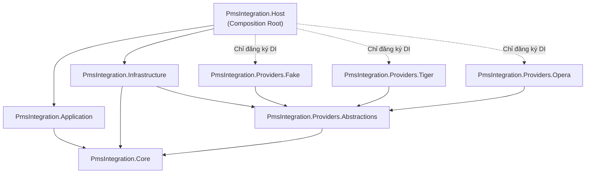
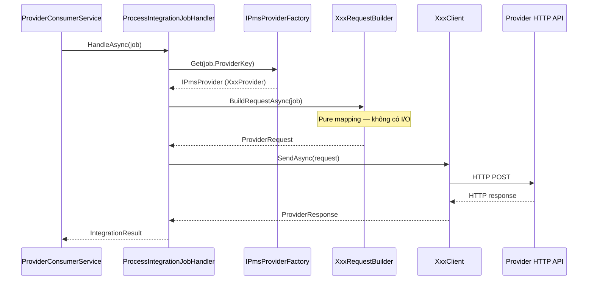
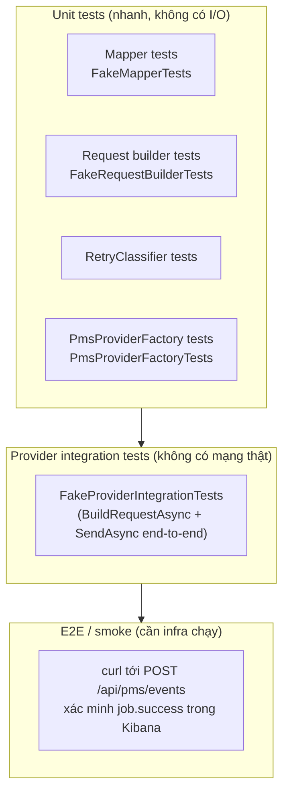
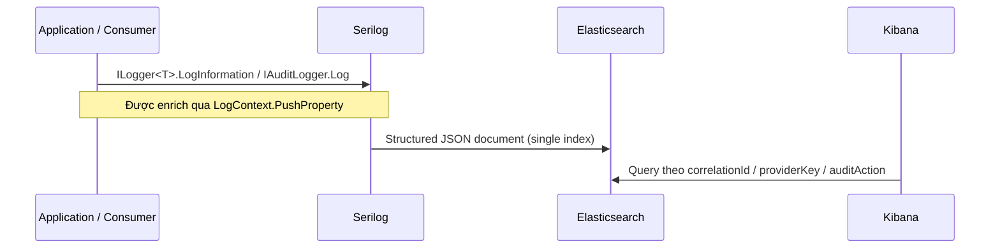

# Sổ tay Kỹ thuật Dành cho Developer

> Chào mừng bạn đến với team Dịch vụ Tích hợp PMS.  
> Sổ tay này là tài liệu tham khảo duy nhất để hiểu cấu trúc codebase, cách mở rộng và vận hành dịch vụ. Tất cả ví dụ code sử dụng tên lớp thực tế từ source; bất kỳ điều gì chưa chắc đều được đánh dấu **TODO**.

---

## Mục lục

1. [Tổng quan kiến trúc](#tổng-quan-kiến-trúc)
2. [Code sống ở đâu](#code-sống-ở-đâu)
3. [Chạy dịch vụ cục bộ](#chạy-dịch-vụ-cục-bộ)
4. [Thêm nhà cung cấp mới](#thêm-nhà-cung-cấp-mới)
5. [Thêm loại sự kiện mới](#thêm-loại-sự-kiện-mới)
6. [Chiến lược kiểm thử](#chiến-lược-kiểm-thử)
7. [Logging và xử lý sự cố trong Kibana](#logging-và-xử-lý-sự-cố-trong-kibana)
8. [Các lỗi thường gặp và anti-pattern](#các-lỗi-thường-gặp-và-anti-pattern)

---

## Tổng quan kiến trúc

Dịch vụ là một **integration gateway**: nhận sự kiện HTTP từ PMS (Property Management System), fan-out mỗi sự kiện vào một hàng đợi RabbitMQ mỗi nhà cung cấp, và xử lý các hàng đợi đó bất đồng bộ.

Pattern cấu trúc là **Provider Plugin (Cách tiếp cận B1)**. Mỗi nhà cung cấp (Tiger, Opera, Fake, …) là một dự án độc lập triển khai `IPmsProvider`. Pipeline không bao giờ chứa `switch(providerCode)` — nó gọi `IPmsProviderFactory.Get(providerCode)` và factory phân giải plugin đúng.

### Sơ đồ phụ thuộc



### Từng tầng được phép làm gì

| Tầng | Có thể tham chiếu | Không thể tham chiếu |
|---|---|---|
| `Core` | không có gì | mọi thứ khác |
| `Application` | `Core` | `Infrastructure`, bất kỳ `Providers.*` nào |
| `Infrastructure` | `Core`, `Providers.Abstractions` | `Application`, bất kỳ `Providers.*` nào |
| `Providers.*` | `Core`, `Providers.Abstractions` | nhau, `Infrastructure`, `Application` |
| `Host` | mọi thứ (chỉ DI wiring) | không được chứa business logic |

---

## Code sống ở đâu

### Bản đồ dự án có chú thích

```
src/
│
├── PmsIntegration.Core/
│   ├── Abstractions/           ← chỉ là interfaces (IPmsProvider, IPmsProviderFactory,
│   │                              IQueuePublisher, IAuditLogger, IIdempotencyStore,
│   │                              IClock, IConfigProvider, IPmsMapper,
│   │                              IPmsRequestBuilder, IPmsClient)
│   ├── Contracts/              ← hình dạng dữ liệu: PmsEventEnvelope, IntegrationJob,
│   │                              ProviderRequest, ProviderResponse, IntegrationResult
│   └── Domain/                 ← kiểu giá trị: IntegrationOutcome, …
│
├── PmsIntegration.Application/
│   ├── UseCases/
│   │   ├── ReceivePmsEventHandler.cs   ← validate → fan-out → enqueue
│   │   └── ProcessIntegrationJobHandler.cs ← idempotency → factory.Get → build → send
│   ├── Services/
│   │   ├── EventValidator.cs    ← xác thực các trường PmsEventEnvelope
│   │   ├── ProviderRouter.cs    ← map providerKey → tên hàng đợi
│   │   └── RetryClassifier.cs  ← HTTP status / exception → IntegrationOutcome
│   └── DI/
│       └── ApplicationServiceExtensions.cs
│
├── PmsIntegration.Infrastructure/
│   ├── RabbitMq/
│   │   ├── RabbitMqConnectionFactory.cs  ← singleton IConnection
│   │   ├── RabbitMqTopology.cs           ← khai báo main/retry/dlq mỗi provider
│   │   ├── RabbitMqQueuePublisher.cs     ← triển khai IQueuePublisher
│   │   └── RabbitMqHeaders.cs
│   ├── Logging/
│   │   ├── ElasticAuditLogger.cs         ← IAuditLogger → ghi AUDIT log entries
│   │   └── SerilogElasticSetup.cs        ← bootstrap Serilog → Console (Elasticsearch sink là TODO production được comment-out)
│   ├── Idempotency/
│   │   ├── InMemoryIdempotencyStore.cs   ← mặc định (dev/single-instance)
│   │   ├── RedisIdempotencyStore.cs      ← production
│   │   └── SqlIdempotencyStore.cs        ← skeleton placeholder (NotImplementedException)
│   ├── Http/DelegatingHandlers/
│   │   └── CorrelationIdHandler.cs       ← inject X-Correlation-Id; phải wired với từng named HttpClient qua .AddHttpMessageHandler<CorrelationIdHandler>()
│   ├── Config/
│   │   └── AppSettingsConfigProvider.cs
│   ├── Clock/
│   │   └── SystemClock.cs
│   ├── Providers/
│   │   └── PmsProviderFactory.cs         ← IPmsProviderFactory (nhận IEnumerable<IPmsProvider>)
│   └── DI/
│       └── InfrastructureServiceExtensions.cs
│
├── Providers/
│   ├── PmsIntegration.Providers.Abstractions/
│   │   └── PmsProviderBase.cs                ← lớp cơ sở tùy chọn cho provider
│   │
│   ├── PmsIntegration.Providers.Fake/        ← triển khai tham chiếu, dùng trong test
│   ├── PmsIntegration.Providers.Tiger/
│   └── PmsIntegration.Providers.Opera/
│       (mỗi provider theo cấu trúc được mô tả trong §4)
```

```
tests/
├── PmsIntegration.Infrastructure.Tests/
│   └── PmsProviderFactoryTests.cs       ← factory: phân giải, duplicate key, unknown key
└── PmsIntegration.Providers.Fake.Tests/
    ├── FakeMapperTests.cs               ← unit thuần: field mapping
    ├── FakeRequestBuilderTests.cs       ← unit thuần: endpoint, headers, body
    ├── FakeClientTests.cs               ← unit: happy path, failure simulation
    └── FakeProviderIntegrationTests.cs  ← integration provider-level (không có infra)
```

---

## Chạy dịch vụ cục bộ

### Yêu cầu

- .NET 10 SDK
- Docker (cho RabbitMQ)
- Elasticsearch (tùy chọn — không bắt buộc cục bộ; `SerilogElasticSetup` hiện chỉ ghi ra Console)

### Khởi động dependencies

```bash
docker run -d --name rabbitmq \
  -p 5672:5672 -p 15672:15672 \
  rabbitmq:3-management
```

### Cấu hình token cục bộ

Tạo hoặc chỉnh sửa `src/PmsIntegration.Host/appsettings.Development.json`:

```json
{
  "PmsSecurity": {
    "FixedToken": "dev-token"
  }
}
```

### Chạy

```bash
dotnet build PmsIntegration.sln
dotnet run --project src/PmsIntegration.Host/PmsIntegration.Host.csproj
```

### Kiểm tra nhanh

```bash
curl -X POST https://localhost:<port>/api/pms/events \
  -H "Content-Type: application/json" \
  -H "X-PMS-TOKEN: dev-token" \
  -d '{
    "hotelId": "H001",
    "eventId": "EVT-001",
    "eventType": "Checkin",
    "providers": ["FAKE"],
    "data": { "guestName": "Jane Doe" }
  }'
```

Mong đợi:

```
HTTP 202 Accepted
X-Correlation-Id: <guid>
{ "status": "accepted", "correlationId": "<guid>" }
```

---

## Thêm nhà cung cấp mới

Đây là task phổ biến nhất. Ước tính **~30 phút** cho provider mới không có API quirks bên ngoài. Làm theo các bước sau chính xác.

### Vòng đời của một lệnh gọi provider



### Bước 1 — Tạo dự án

Tạo `src/Providers/PmsIntegration.Providers.Acme/PmsIntegration.Providers.Acme.csproj`:

```xml
<Project Sdk="Microsoft.NET.Sdk">
  <PropertyGroup>
    <TargetFramework>net10.0</TargetFramework>
    <Nullable>enable</Nullable>
    <ImplicitUsings>enable</ImplicitUsings>
  </PropertyGroup>
  <ItemGroup>
    <!-- Providers.Abstractions là thư mục sibling bên trong src/Providers/ -->
    <ProjectReference Include="..\PmsIntegration.Providers.Abstractions\PmsIntegration.Providers.Abstractions.csproj" />
    <!-- Core là hai cấp trên (src/PmsIntegration.Core/) -->
    <ProjectReference Include="..\..\PmsIntegration.Core\PmsIntegration.Core.csproj" />
  </ItemGroup>
</Project>
```

Thêm dự án vào solution:

```bash
dotnet sln PmsIntegration.sln add src/Providers/PmsIntegration.Providers.Acme/PmsIntegration.Providers.Acme.csproj
```

### Bước 2 — Lớp Options

```csharp
// AcmeOptions.cs
namespace PmsIntegration.Providers.Acme;

public sealed class AcmeOptions
{
    public string BaseUrl        { get; set; } = string.Empty;
    public string ApiKey         { get; set; } = string.Empty;
    public int    TimeoutSeconds { get; set; } = 15;
    // Thêm bất kỳ trường nào dành riêng cho provider tại đây
}
```

### Bước 3 — Mapper (pure function, có thể unit-test)

```csharp
// Mapping/AcmeMapper.cs
using PmsIntegration.Core.Contracts;

namespace PmsIntegration.Providers.Acme.Mapping;

public sealed class AcmeMapper
{
    /// <summary>
    /// Map IntegrationJob vào schema body Acme API.
    /// Không có I/O. Phải deterministic.
    /// </summary>
    public AcmeEventPayload Map(IntegrationJob job)
    {
        // TODO: map các trường job.Data vào schema Acme
        return new AcmeEventPayload
        {
            HotelId   = job.HotelId,
            EventId   = job.EventId,
            EventType = job.EventType
        };
    }
}

// TODO: định nghĩa khớp với request body của Acme API
public sealed class AcmeEventPayload
{
    public string HotelId   { get; set; } = string.Empty;
    public string EventId   { get; set; } = string.Empty;
    public string EventType { get; set; } = string.Empty;
}
```

### Bước 4 — Request builder

```csharp
// AcmeRequestBuilder.cs
using System.Text.Json;
using Microsoft.Extensions.Options;
using PmsIntegration.Core.Contracts;
using PmsIntegration.Providers.Acme.Mapping;

namespace PmsIntegration.Providers.Acme;

public sealed class AcmeRequestBuilder
{
    private readonly AcmeMapper   _mapper;
    private readonly AcmeOptions  _options;

    public AcmeRequestBuilder(AcmeMapper mapper, IOptions<AcmeOptions> options)
    {
        _mapper  = mapper;
        _options = options.Value;
    }

    public Task<ProviderRequest> BuildAsync(IntegrationJob job, CancellationToken ct = default)
    {
        var payload = _mapper.Map(job);

        return Task.FromResult(new ProviderRequest
        {
            ProviderKey = "ACME",
            Method      = "POST",
            Endpoint    = $"{_options.BaseUrl.TrimEnd('/')}/events",
            JsonBody    = JsonSerializer.Serialize(payload),
            Headers     = new Dictionary<string, string>
            {
                ["X-Api-Key"]        = _options.ApiKey,
                ["X-Correlation-Id"] = job.CorrelationId
            }
        });
    }
}
```

> **Lưu ý:** Kiểm tra các thuộc tính thực tế của `ProviderRequest` trong `src/PmsIntegration.Core/Contracts/ProviderRequest.cs` — Fake tests xác nhận `Endpoint`, `Method`, `JsonBody` và `Headers` tồn tại.

### Bước 5 — HTTP client

```csharp
// AcmeClient.cs
using System.Text;
using Microsoft.Extensions.Logging;
using Microsoft.Extensions.Options;
using PmsIntegration.Core.Contracts;

namespace PmsIntegration.Providers.Acme;

public sealed class AcmeClient
{
    private readonly IHttpClientFactory   _httpFactory;
    private readonly AcmeOptions          _options;
    private readonly ILogger<AcmeClient>  _logger;

    public AcmeClient(
        IHttpClientFactory httpFactory,
        IOptions<AcmeOptions> options,
        ILogger<AcmeClient> logger)
    {
        _httpFactory = httpFactory;
        _options     = options.Value;
        _logger      = logger;
    }

    public async Task<ProviderResponse> SendAsync(ProviderRequest request, CancellationToken ct = default)
    {
        var http = _httpFactory.CreateClient("ACME");

        using var content = new StringContent(request.JsonBody ?? string.Empty, Encoding.UTF8, "application/json");
        // TODO: thêm auth nếu cần ngoài header X-Api-Key đặt trong builder

        var response = await http.PostAsync(request.Endpoint, content, ct);

        return new ProviderResponse
        {
            StatusCode = (int)response.StatusCode,
            Body       = await response.Content.ReadAsStringAsync(ct)
        };
    }
}
```

### Bước 6 — Lớp Provider

```csharp
// AcmeProvider.cs
using PmsIntegration.Core.Contracts;
using PmsIntegration.Providers.Abstractions;

namespace PmsIntegration.Providers.Acme;

public sealed class AcmeProvider : PmsProviderBase
{
    public override string ProviderKey => "ACME";   // phải khớp với config key chính xác

    private readonly AcmeRequestBuilder _builder;
    private readonly AcmeClient         _client;

    public AcmeProvider(AcmeRequestBuilder builder, AcmeClient client)
    {
        _builder = builder;
        _client  = client;
    }

    public override Task<ProviderRequest> BuildRequestAsync(IntegrationJob job, CancellationToken ct = default)
        => _builder.BuildAsync(job, ct);

    public override Task<ProviderResponse> SendAsync(ProviderRequest request, CancellationToken ct = default)
        => _client.SendAsync(request, ct);
}
```

### Bước 7 — DI extension method

```csharp
// DI/AcmeServiceExtensions.cs
using Microsoft.Extensions.Configuration;
using Microsoft.Extensions.DependencyInjection;
using PmsIntegration.Core.Abstractions;
using PmsIntegration.Providers.Acme.Mapping;

namespace PmsIntegration.Providers.Acme.DI;

public static class AcmeServiceExtensions
{
    /// <summary>Config section: Providers:ACME</summary>
    public static IServiceCollection AddAcmeProvider(
        this IServiceCollection services,
        IConfiguration configuration)
    {
        services.Configure<AcmeOptions>(configuration.GetSection("Providers:ACME"));

        services.AddHttpClient("ACME", (sp, client) =>
        {
            var opts = sp.GetRequiredService<Microsoft.Extensions.Options.IOptions<AcmeOptions>>().Value;
            client.BaseAddress = new Uri(opts.BaseUrl);
            client.Timeout     = TimeSpan.FromSeconds(opts.TimeoutSeconds);
        });

        services.AddSingleton<AcmeMapper>();
        services.AddSingleton<AcmeRequestBuilder>();
        services.AddSingleton<AcmeClient>();
        services.AddSingleton<IPmsProvider, AcmeProvider>();   // ← factory phát hiện cái này

        return services;
    }
}
```

### Bước 8 — Cấu hình

`appsettings.json` — hai entry mới:

```json
{
  "Providers": {
    "ACME": {
      "BaseUrl": "https://api.acme-pms.example.com",
      "ApiKey": "",
      "TimeoutSeconds": 15
    }
  },
  "Queues": {
    "ProviderQueues": {
      "ACME": "q.pms.acme"
    }
  }
}
```

### Bước 9 — Wired vào Host (hai thay đổi)

**`src/PmsIntegration.Host/PmsIntegration.Host.csproj`** — thêm project reference:

```xml
<ProjectReference Include="..\Providers\PmsIntegration.Providers.Acme\PmsIntegration.Providers.Acme.csproj" />
```

**`src/PmsIntegration.Host/Providers/ProvidersServiceExtensions.cs`** — thêm một dòng **trước** `services.AddSingleton<IPmsProviderFactory, PmsProviderFactory>()`:

```csharp
services.AddFakeProvider(configuration);
services.AddTigerProvider(configuration);
services.AddOperaProvider(configuration);
services.AddAcmeProvider(configuration);   // ← dòng mới

services.AddSingleton<IPmsProviderFactory, PmsProviderFactory>();
```

### Bước 10 — Build và xác minh

```bash
dotnet build PmsIntegration.sln
```

Khi khởi động, log phải chứa dòng từ `ProviderConsumerOrchestrator` cho `ACME`. Kiểm tra `IPmsProviderFactory.RegisteredKeys` trong health endpoint hoặc startup logs.

### Bước 11 — Viết tests

Xem [Chiến lược kiểm thử — Tests cho Provider](#tests-cho-provider).

---

## Thêm loại sự kiện mới

"Loại sự kiện" là giá trị chuỗi của `PmsEventEnvelope.EventType` (ví dụ `"Checkin"`, `"Checkout"`, `"AddGuest"`). Pipeline là **event-type-agnostic theo mặc định** — `IntegrationJob` mang chuỗi `EventType` thô và payload opaque `JsonElement? Data` thẳng đến provider.

Loại sự kiện mới do đó chỉ đòi hỏi thay đổi nơi hình dạng dữ liệu được giải thích hoặc xác thực.

### Decision tree

```
Loại sự kiện mới có cần quy tắc xác thực mới không?
  └─ Có → chỉnh sửa EventValidator (Application)

Loại sự kiện mới có schema dữ liệu khác mà provider cần map khác không?
  └─ Có → cập nhật Mapper trong mỗi dự án Providers.* bị ảnh hưởng

Loại sự kiện mới có cần quy tắc định tuyến khác (hàng đợi khác) không?
  └─ Có → xem xét ProviderRouter (Application) — HÔM NAY nó map theo provider key, không phải event type
           TODO: xác nhận logic định tuyến hiện tại xử lý được điều này hoặc cần mở rộng

PmsEventEnvelope có cần trường mới không?
  └─ Có → thêm vào Core/Contracts/PmsEventEnvelope.cs và cập nhật IntegrationJob nếu cần mang theo
```

### Từng bước

#### 1 — Xác thực loại sự kiện mới (nếu cần)

Mở `src/PmsIntegration.Application/Services/EventValidator.cs` và thêm bất kỳ yêu cầu trường nào dành riêng cho loại sự kiện mới.

```csharp
// Pattern ví dụ (kiểm tra triển khai thực tế trước)
if (envelope.EventType == "RoomUpgrade" && envelope.Data.ValueKind == JsonValueKind.Undefined)
    throw new ArgumentException("RoomUpgrade events must include a Data payload.");
```

#### 2 — Cập nhật mapper cho mỗi provider bị ảnh hưởng

Mỗi mapper nhận `IntegrationJob` trong đó `job.EventType` xác định sự kiện và `job.Data` là `JsonElement?` chứa payload thô.

```csharp
// Trong AcmeMapper.Map(IntegrationJob job):
return job.EventType switch
{
    "Checkin"     => MapCheckin(job),
    "Checkout"    => MapCheckout(job),
    "RoomUpgrade" => MapRoomUpgrade(job),  // ← nhánh mới
    _             => MapGeneric(job)
};
```

Viết unit test cho nhánh mới — xem [Tests cho Mapper](#tests-cho-mapper).

#### 3 — Cập nhật IntegrationJob / PmsEventEnvelope (chỉ khi cần trường mới)

Nếu loại sự kiện mới mang dữ liệu không thể biểu diễn trong `JsonElement? Data`, thêm các trường strongly typed vào `PmsEventEnvelope` và `IntegrationJob` trong `Core/Contracts/`.

> Ưu tiên sử dụng `JsonElement? Data` opaque bag cho payload dành riêng cho event-type. Chỉ thêm các trường strongly typed vào contracts cho các thuộc tính phổ quát trên tất cả loại sự kiện (ví dụ `HotelId`, `EventId` đã là như vậy).

#### 4 — Không cần thay đổi trong

- `Host` — controller chấp nhận bất kỳ envelope hợp lệ nào
- `Infrastructure` — queue publishing là provider-keyed, không phải event-type-keyed
- `ReceivePmsEventHandler` — fan-out theo `envelope.Providers`, không phải event type
- Các provider khác — mapper của mỗi provider xử lý nhánh event-type của riêng nó

---

## Chiến lược kiểm thử

Dự án sử dụng **xUnit** và **FluentAssertions**. Không cần mocking framework cho provider tests — infrastructure được giữ ra ngoài provider logic theo thiết kế.

### Test pyramid



### Tests cho Mapper

Kiểm thử lớp mapper hoàn toàn độc lập — không có DI, không có mock, không có mạng.

```csharp
// Pattern từ FakeMapperTests.cs
public sealed class AcmeMapperTests
{
    private readonly AcmeMapper _sut = new();

    [Fact]
    public void Map_ShouldSerializeAllJobFields()
    {
        var job = new IntegrationJob
        {
            HotelId       = "hotel-123",
            EventId       = "evt-456",
            EventType     = "Checkin",
            CorrelationId = "corr-789",
            Data          = JsonDocument.Parse("{\"roomNumber\":\"101\"}").RootElement
        };

        var result = _sut.Map(job);

        result.HotelId.Should().Be("hotel-123");
        result.EventType.Should().Be("Checkin");
        // assert tất cả trường được map
    }
}
```

### Tests cho Request builder

Khởi tạo builder với `Options.Create(new AcmeOptions { ... })` — không cần DI container.

```csharp
// Pattern từ FakeRequestBuilderTests.cs
public sealed class AcmeRequestBuilderTests
{
    private static AcmeRequestBuilder CreateSut(
        string baseUrl = "https://acme.local",
        string apiKey  = "test-key")
    {
        var options = Options.Create(new AcmeOptions
        {
            BaseUrl = baseUrl,
            ApiKey  = apiKey
        });
        return new AcmeRequestBuilder(new AcmeMapper(), options);
    }

    [Fact]
    public async Task BuildAsync_ShouldSetCorrectEndpoint()
    {
        var request = await CreateSut("https://acme.local/").BuildAsync(MakeJob());
        request.Endpoint.Should().Be("https://acme.local/events");
    }

    [Fact]
    public async Task BuildAsync_ShouldSetProviderKeyToACME()
    {
        var request = await CreateSut().BuildAsync(MakeJob());
        request.ProviderKey.Should().Be("ACME");
    }

    [Fact]
    public async Task BuildAsync_ShouldAddApiKeyHeader()
    {
        var request = await CreateSut(apiKey: "secret-xyz").BuildAsync(MakeJob());
        request.Headers.Should().ContainKey("X-Api-Key")
            .WhoseValue.Should().Be("secret-xyz");
    }
}
```

### Tests tích hợp Provider

Kiểm tra toàn bộ provider chain (`BuildRequestAsync` → `SendAsync`) không có mạng thật. Dùng `NullLogger<T>.Instance` cho các logger dependency.

```csharp
// Pattern từ FakeProviderIntegrationTests.cs
public sealed class AcmeProviderIntegrationTests
{
    private static AcmeProvider CreateProvider()
    {
        var options = Options.Create(new AcmeOptions
        {
            BaseUrl = "https://acme.local",
            ApiKey  = "test-key",
            TimeoutSeconds = 10
        });

        var mapper  = new AcmeMapper();
        var builder = new AcmeRequestBuilder(mapper, options);
        // TODO: nếu AcmeClient cần HTTP call thật, dùng WireMock.Net hoặc thay bằng test double
        var client  = new AcmeClient(/* ... */, options, NullLogger<AcmeClient>.Instance);

        return new AcmeProvider(builder, client);
    }

    [Fact]
    public void ProviderKey_ShouldBeACME()
    {
        CreateProvider().ProviderKey.Should().Be("ACME");
    }

    [Fact]
    public async Task BuildRequest_ShouldContainHotelId()
    {
        var provider = CreateProvider();
        var job      = new IntegrationJob { HotelId = "H001", EventType = "Checkin", EventId = "E1" };

        var request  = await provider.BuildRequestAsync(job);

        request.ProviderKey.Should().Be("ACME");
        request.JsonBody.Should().Contain("H001");
    }
}
```

### Tests PmsProviderFactory

Factory tests nằm trong `PmsIntegration.Infrastructure.Tests` và sử dụng lightweight inline stubs (không cần mocking framework):

```csharp
// Pattern từ PmsProviderFactoryTests.cs
private sealed class StubProvider : IPmsProvider
{
    public StubProvider(string providerKey) => ProviderKey = providerKey;
    public string ProviderKey { get; }
    public Task<ProviderRequest> BuildRequestAsync(IntegrationJob job, CancellationToken ct = default)
        => throw new NotImplementedException();
    public Task<ProviderResponse> SendAsync(ProviderRequest request, CancellationToken ct = default)
        => throw new NotImplementedException();
}

[Fact]
public void Get_WithRegisteredKey_ReturnsCorrectProvider()
{
    var tiger  = new StubProvider("TIGER");
    var opera  = new StubProvider("OPERA");
    var factory = new PmsProviderFactory(new[] { tiger, opera });

    factory.Get("tiger").Should().BeSameAs(tiger);   // case-insensitive
}

[Fact]
public void Get_WithUnknownKey_ThrowsInvalidOperationException()
{
    var factory = new PmsProviderFactory(new[] { new StubProvider("TIGER") });
    var act = () => factory.Get("NONEXISTENT");
    act.Should().Throw<InvalidOperationException>();
}
```

### Chạy tests

```bash
# Tất cả tests
dotnet test PmsIntegration.sln

# Dự án đơn
dotnet test tests/PmsIntegration.Providers.Fake.Tests/PmsIntegration.Providers.Fake.Tests.csproj

# Lớp test đơn
dotnet test --filter "FullyQualifiedName~FakeMapperTests"
```

---

## Logging và xử lý sự cố trong Kibana

### Luồng log hoạt động như thế nào

> **Trạng thái hiện tại:** `SerilogElasticSetup.Configure` chỉ ghi ra **Console**. Sơ đồ bên dưới cho thấy luồng production dự định với Elasticsearch. Bật bằng cách wiring `Serilog.Sinks.Elasticsearch` trong `SerilogElasticSetup.cs`.



Serilog được bootstrap bởi `SerilogElasticSetup.Configure` trước khi DI container khởi động. Tất cả structured field đặt trên `LogContext` xuất hiện như first-class Kibana fields.

### Trường bắt buộc trên mỗi log entry

| Trường | Kiểu | Cách đến đó |
|---|---|---|
| `correlationId` | string GUID | `LogContext.PushProperty` trong consumer/handler |
| `hotelId` | string | `LogContext.PushProperty` |
| `eventId` | string | `LogContext.PushProperty` |
| `eventType` | string | `LogContext.PushProperty` |
| `providerKey` | string | `LogContext.PushProperty` |
| `jobId` | string GUID | `LogContext.PushProperty` khi có |
| `attempt` | int | `LogContext.PushProperty` trong vòng lặp retry consumer |

### Từ vựng audit action

Tất cả sự kiện audit được ghi bởi `ElasticAuditLogger` với trường `auditAction`:

| `auditAction` | Ý nghĩa |
|---|---|
| `pms.received` | Envelope được chấp nhận bởi `PmsEventController` |
| `job.enqueued` | `IntegrationJob` được publish lên provider queue |
| `job.processing` | Consumer bắt đầu xử lý job |
| `job.success` | Provider API phản hồi thành công |
| `job.retryable_failed` | Lệnh gọi Provider API thất bại với kết quả có thể retry (5xx, 408, 429, timeout) |
| `job.failed` | Lệnh gọi Provider API thất bại với kết quả **không thể retry** (4xx ngoại trừ 408/429, lỗi mapping) |
| `job.provider_not_registered` | `IPmsProviderFactory.Get` không tìm thấy provider cho key |
| `job.duplicate_ignored` | Kiểm tra idempotency từ chối vì trùng lặp |

> **Lưu ý:** Chuyển job sang DLQ được log qua `_logger.LogWarning` bên trong `ProviderConsumerService` (không qua `IAuditLogger`). Không có sự kiện audit `job.dlq` nào được emit.

### Truy vấn Kibana cho các tình huống thường gặp

**Theo dõi một sự kiện từ đầu đến cuối:**

```
correlationId:"3fa85f64-5717-4562-b3fc-2c963f66afa6"
```

Sắp xếp theo `@timestamp` asc. Bạn sẽ thấy toàn bộ chuỗi: `pms.received` → `job.enqueued` → `job.processing` → `job.success`

**Tất cả lỗi của một provider (có thể retry hoặc không thể retry):**

```
providerKey:"TIGER" AND (auditAction:"job.retryable_failed" OR auditAction:"job.failed")
```

**Tất cả sự kiện DLQ trong 24 giờ gần đây:**

```
level:"Warning" AND message:*DLQ*
```

> Định tuyến DLQ được log qua `ILogger.LogWarning` trong `ProviderConsumerService`, không qua `IAuditLogger`.

**Sự kiện của một khách sạn cụ thể:**

```
hotelId:"H001" AND eventType:"Checkin"
```

**Chuỗi retry cho một job:**

```
jobId:"7c9e6679-7425-40de-944b-e07fc1f90ae7"
```

Sắp xếp `@timestamp` asc, kiểm tra trường `attempt` tăng dần.

### Đọc một lỗi

Khi `job.failed` xuất hiện, kiểm tra:

1. `x-last-error-code` — HTTP status hoặc exception type
2. `x-last-error-message` — trích đoạn error body của provider
3. `attempt` — số lần retry đã xảy ra

Nếu `attempt` bằng `MaxRetryAttempts` (mặc định `3`), entry tiếp theo trong log sẽ là `LogWarning` từ `ProviderConsumerService` cho biết job được gửi đến DLQ (không phải audit action — tìm `message:*DLQ*` hoặc `message:*Sending to DLQ*`).

### Push log context trong code mới

Bất cứ khi nào bạn viết handler hoặc consumer xử lý `IntegrationJob`, push các trường bắt buộc ngay lập tức:

```csharp
using (Serilog.Context.LogContext.PushProperty("correlationId", job.CorrelationId))
using (Serilog.Context.LogContext.PushProperty("hotelId",       job.HotelId))
using (Serilog.Context.LogContext.PushProperty("eventId",       job.EventId))
using (Serilog.Context.LogContext.PushProperty("eventType",     job.EventType))
using (Serilog.Context.LogContext.PushProperty("providerKey",   job.ProviderKey))
using (Serilog.Context.LogContext.PushProperty("jobId",         job.JobId))
{
    // tất cả lệnh gọi log bên trong block này sẽ tự động mang các trường này
}
```

> Chỉ dùng `Serilog.Context.LogContext` trong `Infrastructure` và `Host`. Trong `Application` và `Core`, dùng `ILogger<T>` inject qua DI — không bao giờ tham chiếu Serilog trực tiếp.

---

## Các lỗi thường gặp và anti-pattern

### 1. `switch(providerCode)` ngoài `PmsProviderFactory`

```csharp
// ❌ KHÔNG BAO GIỜ làm điều này
switch (job.ProviderKey)
{
    case "TIGER": await _tigerClient.SendAsync(...); break;
    case "OPERA": await _operaClient.SendAsync(...); break;
}

// ✅ Luôn làm
var provider = _factory.Get(job.ProviderKey);
await provider.SendAsync(request, ct);
```

Mỗi provider mới sẽ đòi hỏi chỉnh sửa code `Application` hiện có. Kiến trúc plugin tồn tại chính xác để ngăn điều này.

---

### 2. Đăng ký `PmsProviderFactory` trước `AddXxxProvider()`

```csharp
// ❌ Factory được đăng ký trước providers — IEnumerable<IPmsProvider> sẽ trống
services.AddSingleton<IPmsProviderFactory, PmsProviderFactory>();
services.AddTigerProvider(configuration);

// ✅ Luôn đăng ký providers trước
services.AddTigerProvider(configuration);
services.AddSingleton<IPmsProviderFactory, PmsProviderFactory>();
```

Factory nhận `IEnumerable<IPmsProvider>` khi khởi tạo. Nếu nó được khởi tạo trước, enumerable chỉ chứa các provider đã đăng ký — tức là không có gì.

---

### 3. `BasicNack(requeue: true)` cho retry

```csharp
// ❌ Tạo vòng lặp nóng vô hạn — tin nhắn re-queue ngay lập tức không có độ trễ
channel.BasicNack(deliveryTag, multiple: false, requeue: true);

// ✅ Publish lên hàng đợi .retry, sau đó ACK
await publisher.PublishAsync(job, retryQueue, ct);
channel.BasicAck(deliveryTag, multiple: false);
```

Hàng đợi `.retry` có TTL được cấu hình theo `RetryDelaySeconds`. Tin nhắn chỉ dead-letter trở lại hàng đợi chính sau độ trễ đó.

---

### 4. Tham chiếu `RabbitMQ.Client` từ `Core` hoặc `Application`

`Core` không có external dependencies. `Application` chỉ phụ thuộc vào Core interfaces.

```csharp
// ❌ Trong Application/UseCases/SomeHandler.cs
using RabbitMQ.Client;

// ✅ Dùng IQueuePublisher (định nghĩa trong Core.Abstractions, triển khai trong Infrastructure)
public class SomeHandler
{
    public SomeHandler(IQueuePublisher publisher) { ... }
}
```

---

### 5. Gọi `Serilog.Log.*` từ `Core` hoặc `Application`

```csharp
// ❌ Trong Application
Serilog.Log.Information("Processing job {JobId}", job.JobId);

// ✅ Dùng Microsoft.Extensions.Logging.ILogger<T>
private readonly ILogger<ProcessIntegrationJobHandler> _logger;
_logger.LogInformation("Processing job {JobId}", job.JobId);
```

Serilog thực thi `ILogger<T>` khi chạy qua `UseSerilog()`. Nếu logging backend ever được hoán đổi, chỉ `Infrastructure` và `Host` thay đổi.

---

### 6. Một dự án provider tham chiếu dự án provider khác

```xml
<!-- ❌ Trong PmsIntegration.Providers.Tiger.csproj -->
<ProjectReference Include="..\PmsIntegration.Providers.Opera\..." />
```

Các dự án provider phải hoàn toàn độc lập. Chúng chỉ được tham chiếu `Core` và `Providers.Abstractions`. Cross-provider coupling phá vỡ việc triển khai và kiểm thử độc lập.

---

### 7. Đặt `ProviderKey` thành chữ thường hoặc mixed-case

```csharp
// ❌ Sẽ khiến PmsProviderFactory.Get thất bại im lặng nếu caller dùng "TIGER"
public override string ProviderKey => "tiger";

// ✅ Luôn in hoa
public override string ProviderKey => "TIGER";
```

`PmsProviderFactory` chuẩn hóa key bằng `Trim().ToUpperInvariant()` trước khi tra cứu, nhưng key đã đăng ký cũng phải in hoa để khớp với config, tên hàng đợi và message header một cách nhất quán (xem quy tắc ProviderCode trong [CONVENTIONS.vi.md](../CONVENTIONS.vi.md#quy-tắc-providercode)).

---

### 8. Thêm business logic vào `Host`

`Host` là composition root. Nó wires mọi thứ lại với nhau.

```csharp
// ❌ Trong PmsEventController
if (envelope.EventType == "Checkin")
    envelope.Providers.Add("TIGER");   // logic định tuyến KHÔNG thuộc về đây

// ✅ Logic định tuyến thuộc về Application/Services/ProviderRouter.cs
```

---

### 9. Bỏ qua kiểm tra idempotency trong handler mới

Nếu bạn viết consumer hoặc handler mới xử lý `IntegrationJob`, luôn gọi `IIdempotencyStore.TryAcquire` trước khi gọi provider. PMS có thể retry sự kiện; consumer có thể nhận duplicates sau khi restart. Idempotency ngăn chặn lệnh gọi provider API dư thừa.

Định dạng khóa idempotency: `{hotelId}:{eventId}:{eventType}:{providerKey}`

---

### 10. Hard-code tên hàng đợi

```csharp
// ❌
await publisher.PublishAsync(job, "q.pms.tiger", ct);

// ✅ Phân giải qua ProviderRouter đọc từ IConfigProvider (backed bởi appsettings)
var queue = _router.ResolveQueue(job.ProviderKey);
await publisher.PublishAsync(job, queue, ct);
```

Tên hàng đợi nằm trong `Queues:ProviderQueues` trong `appsettings.json`. Hard-code chúng có nghĩa là thay đổi config không đủ để đổi tên hàng đợi.
